# Handcheck sheet

Twenty games for manual labelling. No automatic labels.

---

## async 234/2 · stock

**Game ID:** `async 234/2`  
**Condition:** stock

### TRUE WIRES

blue, red, red, white, white, blue

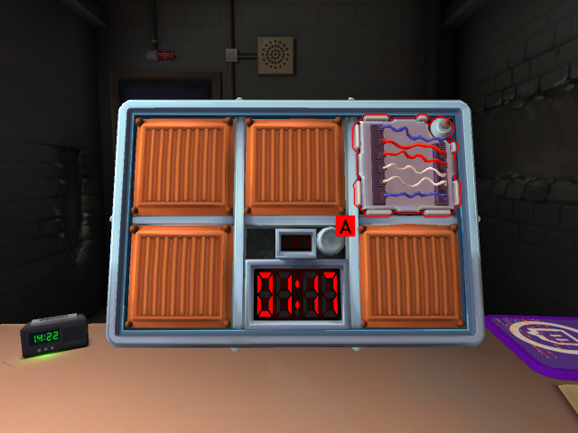


### CORRECT WIRE

position **6**, colour **blue**

### DEFUSER MESSAGES

**Defuser #1**

```
Front face: only interactive module is top-right with 6 horizontal wires (top to bottom: red, red, white, white, blue, blue). There’s a small circular light/LED at the module’s top-right corner (currently not green). Timer reads 01:17. Strike display above timer shows no red X.
```

**Defuser #2**

```
Visible front face: four large orange vent panels (top-left, top-middle, bottom-left, bottom-right) that look non-interactive. One interactive module at top-right: a grey panel with 6 horizontal wires across it; from top to bottom the wire colors are red, red, white, white, blue, blue. The module’s small status light at its top-right is not green (unsolved). Center has the timer area; time currently 01:13. Strike display above the timer shows no red Xs.
```

**Defuser #3**

```
Timer now 01:10, still 0 strikes. Only unsolved module visible is the 6-wire panel (top-to-bottom: red, red, white, white, blue, blue). Tell me which wire number to cut (1=top, 6=bottom).
```

**Defuser #4**

```
I cut the bottom wire. No strike appeared, and the module’s small status light at the top-right turned bright green (wire module solved). Timer now 01:02.
```

**Defuser #5**

```
1) Outcome: bomb defused successfully. You provided the correct high-level instruction (cut wire 6), and I accurately reported the wire colors/order, executed the cut, and confirmed solve/no strike.
2) Communication challenges: role/prompt mismatch—some turns had “no_new_messages” and I acted without clear guidance; also I used internal location markers in actions but avoided mentioning them to you. Minor confusion when you asked if I’d cut yet while I was still interacting.
3) Mistakes/missed opportunities: I didn’t always explicitly state I was about to perform an action before doing it, which could have caused desync. Also I didn’t immediately pivot to scouting other sides/modules after solving; I waited for direction. I recognized issues via your follow-up questions (“Have you cut…”) and the time pressure.
4) What worked: concise, structured observation (wire colors top-to-bottom, timer, strikes) and you giving a single clear directive (“cut the last wire”). What didn’t: delays between instruction and confirmation, and lack of proactive full-bomb recon once the first module was solved.
5) Next time: I’d start with a rapid full survey (all faces/edges for batteries/serial/indicators/ports + all modules), then report in one compact message. Before any risky interaction, I’d echo the planned action (“Cutting wire 6 now”) and immediately report result.
6) Lessons: agree on a standard info packet (time, strikes, serial, batteries, indicators, ports, module descriptions). Keep commands unambiguous (wire numbers, button labels/colors). Confirm action-result loops quickly to prevent misunderstandings under time pressure.
```

### EXPERT MESSAGES

**Expert #1**

```
I'm ready to help you defuse the bomb. Please describe what you see on the bomb right now, including any modules visible and the timer.
```

**Expert #2**

```
You have a wire module with 6 wires. Cut the last wire (the bottom blue wire).
```

**Expert #3**

```
Have you cut the last wire yet? Let me know once you do and whether the status light turns green.
```

**Expert #4**

```
Cut wire 6 (the bottom wire).
```

**Expert #5**

```
Excellent! The wire module is solved. What other modules or elements do you see on the bomb now?
```

**Expert #6**

```
Excellent work! Here's my reflection on our successful defusal:

1. **Final Outcome**: We successfully defused the bomb with zero strikes. Only one module (the 6-wire puzzle) was present, and we solved it correctly on the first attempt.

2. **Communication**: Communication was clear and efficient. You provided accurate descriptions of the bomb's layout, and I delivered direct instructions based on the manual. There were no misunderstandings.

3. **Mistakes**: There were no mistakes. The wire module rules were straightforward—the last wire was blue, so cutting wire 6 was the correct action.

4. **Strategies That Worked**: Concise, direct communication without unnecessary detail. Clear role separation (you as Defuser, me as Expert). Immediate action rather than over-explaining.

5. **Future Improvements**: On more complex bombs with multiple modules, I would proactively ask about bomb elements (serial number, ports, batteries) early on, since many modules depend on this information. This would reduce back-and-forth during critical moments.

6. **Key Lessons**: The importance of clarity under time pressure, trusting the manual, and maintaining focus on one module at a time. Your accurate descriptions were crucial to success.
```

### CUTS

- Cut 1: position **6**, colour **blue**, no strike

### RESULT

solved

MY LABEL: the wire was not the right

MY NOTE: no


---

## async 337/3 · stock

**Game ID:** `async 337/3`  
**Condition:** stock

### TRUE WIRES

black, blue, yellow, blue, black, blue

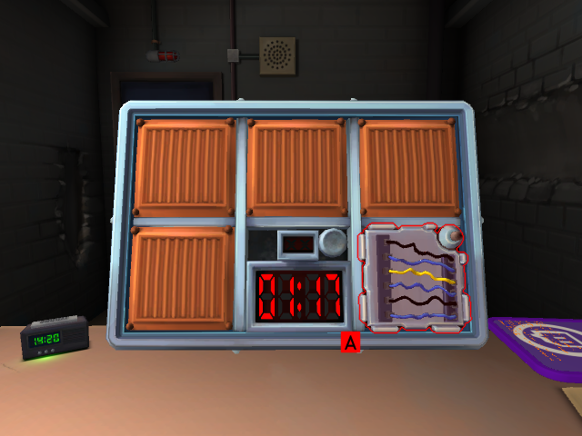

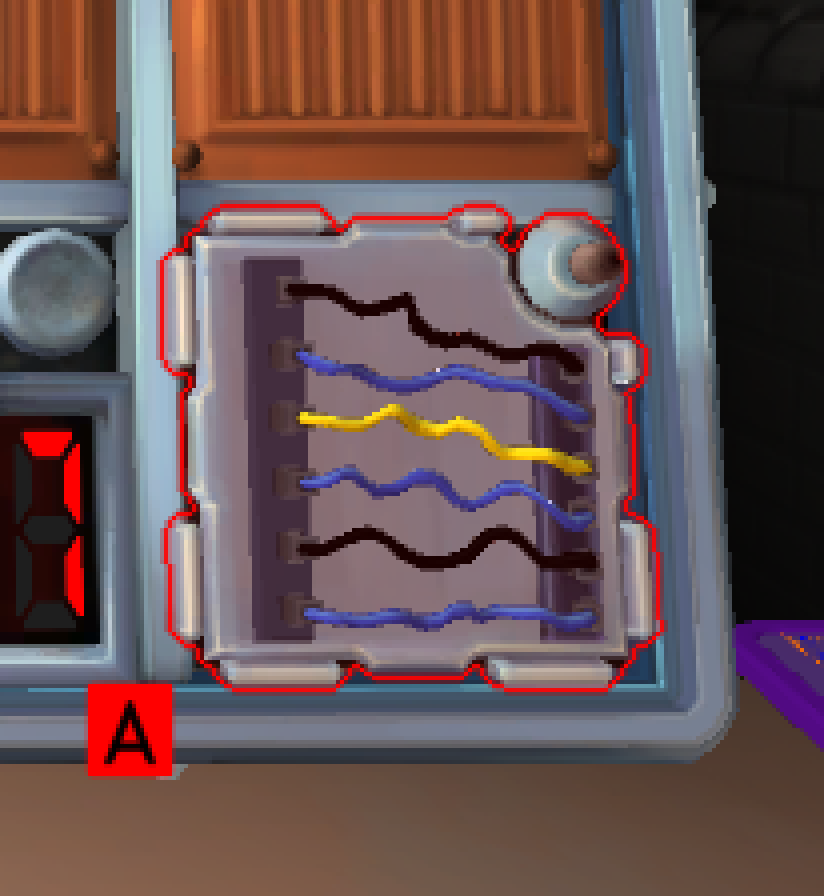

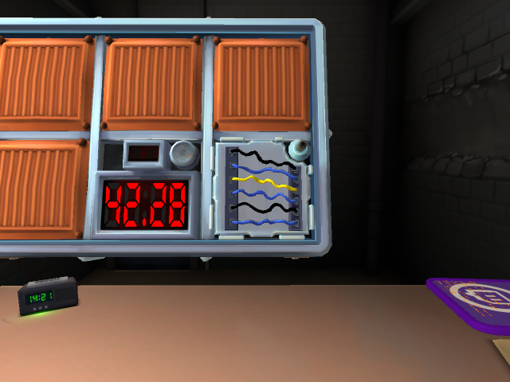

### CORRECT WIRE

position **6**, colour **blue**

### DEFUSER MESSAGES

**Defuser #1**

```
Front face: timer shows 01:17, no red X strikes visible. One module on the right has 6 horizontal wires inside a panel: from top to bottom the wire colors are black, brown, yellow, blue, black, blue. There’s also a small red button at the top-right of that wire panel. Other visible panels on this face look like blank vented covers.
```

**Defuser #2**

```
I only see one interactive module on this face: the 6-wire panel with the small red button at its top-right. Timer now 01:18, still no strikes showing. I need your instruction which wire number (top=1 to bottom=6) to cut, or whether to press the red button.
```

**Defuser #3**

```
The small red button is physically on the same wire panel/module itself (inside the same grey frame), located at the panel’s top-right corner. I do not see any separate module next to the wires. I also do not see any small status LED on/near the wire panel’s top-right edge of the frame (nothing glowing green or unlit there); the only thing at that corner is the red button.
```

**Defuser #4**

```
Zoomed in now. The red thing at the wire panel’s top-right is a round component that looks like a light/lens (not a pressable button). It’s not glowing at the moment. The panel shows 6 wires from top to bottom: 1 black, 2 brown, 3 yellow, 4 blue, 5 black, 6 blue. I can interact with the wires individually (each wire has its own clickable spot).
```

**Defuser #5**

```
The red piece at the top-right of the wire panel is raised and 3D like a small round lens/cap set into the panel (not a flat marking). It does not look like a large pressable plastic button; more like a small indicator light cover, currently not lit.

I have not looked at the back yet; currently still viewing the front with the timer and wire panel. If you want, tell me to rotate/flip and I’ll report all modules and edge info I see.
```

**Defuser #6**

```
I attempted to cut the bottom (6th) blue wire; it is still visibly connected, so the click didn’t cut it (might have missed the exact clickable spot). No new red X strike appeared. Timer shows 42:08.

I’m still on the same face; flipping didn’t change view (likely because I’m zoomed into the wire module). Tell me if you want me to zoom out first, then flip/rotate to show the back and edges.
```

**Defuser #7**

```
1) Final outcome: you report the bomb was defused successfully. My contribution was providing the observed wire colors/order and attempting the instructed cut; your contribution was interpreting the manual and giving the decisive instruction (cut wire 6) plus next-step planning (requesting back/edge info).

2) Communication challenges: I initially described the small red component as a “button,” which led to confusion about whether it was pressable or an indicator. Also, I didn’t clearly separate “module status LED” vs other lights. This slowed identification of the module and delayed next actions.

3) Mistakes/missed opportunities: I used an invalid location marker once (causing a skipped turn), and later clicked the wrong/ineffective spot so the wire didn’t cut. I recognized these from explicit system feedback (invalid marker) and from visual feedback (wire still intact) plus no strike change. Avoidance: confirm available clickable markers before acting; when cutting, ensure I’m fully zoomed in and click directly on the wire’s interactive segment; immediately report whether the wire visually disappears.

4) What worked well: giving exact top-to-bottom wire colors and confirming strike/time status helped you apply rules. Asking clarifying questions about the red component also helped module identification. What didn’t: imprecise terminology (“button”) and acting before confirming the correct clickable target.

5) If we played again: I’d standardize descriptions (e.g., “round red lens/LED-like cap” vs “button”), always state whether I’m zoomed in/out, and only execute an instruction after confirming the correct interactive marker is present for the exact element. I’d also proactively gather serial/battery/port/indicator info early by zooming out and doing a systematic sweep.

6) Lessons learned: precise vocabulary and shared conventions matter more than speed; confirm interaction affordances (what is clickable/holdable) before acting; after each action, verify outcome with concrete signals (wire removed, status LED green, strike X). A quick structured scan of all faces/edges early reduces later back-and-forth and prevents time loss.
```

### EXPERT MESSAGES

**Expert #1**

```
I need to clarify the module on the right. You mentioned a small red button at the top-right of the wire panel - is this button part of the wire module itself, or is it a separate module next to the wires? Also, can you confirm if there's a small LED light (should glow green when solved) somewhere on or near the wire panel?
```

**Expert #2**

```
I need to clarify the red button at the top-right. Is this something you can press or interact with, or is it a light indicator (like an LED that glows)? This will help me determine which module I'm looking at.
```

**Expert #3**

```
Can you describe the red button more specifically? Does it appear raised or 3D like something you can physically press, or is it flat like a painted marking? Also, are there any modules on the back of the bomb I should know about?
```

**Expert #4**

```
Cut wire 6 (the last blue wire at the bottom).
```

**Expert #5**

```
Cut wire 6 now. After you do, please rotate the bomb to show me the back face and all the edges (serial number, batteries, ports, and any indicators you can see). This will help me guide you through the remaining modules.
```

**Expert #6**

```
Excellent work! The bomb was successfully defused. Here's my reflection on our collaboration:

**Final Outcome:** We successfully defused the bomb by solving the Wires module on the front face. The quick resolution was achieved through systematic problem-solving.

**Communication Challenges:** The primary challenge was the initial description of the LED indicator as a "red button." This created ambiguity about which module we were dealing with. However, we resolved this effectively through targeted clarification questions. You provided increasingly detailed descriptions until we confirmed it was the LED indicator, not a pressable button.

**What Worked Well:** Our questioning strategy was effective. Rather than making assumptions, I asked specific clarifying questions, and you provided detailed responses. Your willingness to zoom in and describe the component more precisely was crucial. We avoided wasting time on incorrect assumptions.

**Missed Opportunity:** I didn't ask about the back of the bomb and its edge elements (serial number, batteries, ports, indicators) until after giving the wire-cutting instruction. Gathering this information earlier would have been more efficient, though it didn't matter since only one module was on the front.

**Key Lesson:** Precise communication about physical details is essential in this game. Terms like "button" vs "LED indicator" have different implications. Clear, detailed descriptions and follow-up questions prevent costly mistakes.

**For Future Games:** Start with a complete bomb survey (all faces and edges) before solving modules, and establish consistent terminology early.
```

### CUTS

- Cut 1: position **6**, colour **blue**, no strike

### RESULT

solved

MY LABEL:

MY NOTE:


---

## async 561/2 · stock

**Game ID:** `async 561/2`  
**Condition:** stock

### TRUE WIRES

blue, red, yellow, white

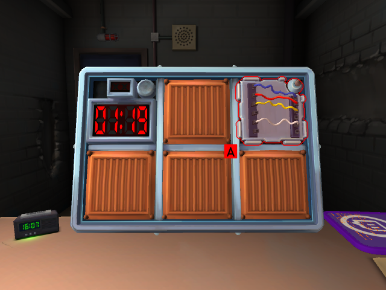


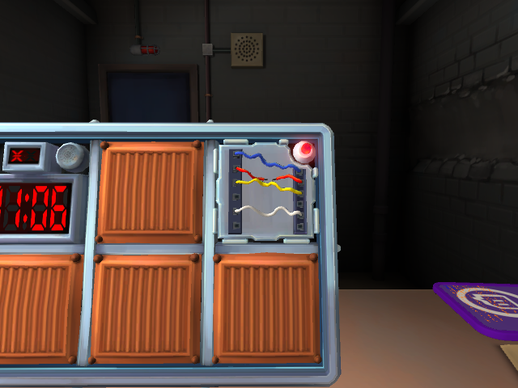

### CORRECT WIRE

position **4**, colour **white**

### DEFUSER MESSAGES

**Defuser #1**

```
I see one module on this face: a panel with 6 wires running left-to-right. From top to bottom the wire colors are: red, blue, yellow, black, red, white. There is a small circular light/LED at the top right of the module frame that is currently not lit. Timer reads 01:19. I don’t see any red strike Xs above the timer.
```

**Defuser #2**

```
Front face: timer currently 01:13, no red strike Xs visible above the timer. Only one interactive module visible on this face: a 6-wire panel (top-to-bottom wire colors: red, blue, yellow, black, red, white). The module’s small status light at its top right is not lit. The other 5 slots on this face are covered panels. I haven’t checked any edges yet for serial/batteries/ports.
```

**Defuser #3**

```
I cut the 2nd wire (blue) and got a strike: one red X is now showing above the timer. The module status light at top right is red (not solved). Timer now shows 01:08.
```

**Defuser #4**

```
Current wire state after the strike: top wire red is still present. Second position is now empty (blue was cut). Third wire yellow present. Fourth wire black present. Fifth wire red present. Sixth wire white present. One strike showing. Timer 01:02.
```

**Defuser #5**

```
Yes, originally it was (top to bottom): 1 red, 2 blue, 3 yellow, 4 black, 5 red, 6 white. Right now after cutting, position 2 is empty; positions 1 red, 3 yellow, 4 black, 5 red, 6 white are still intact. I’m currently looking at a face with 6 covered panels only (no modules visible).
```

**Defuser #6**

```
I rolled to an edge. On this edge I see one port: a 9-pin D-shaped port (looks like serial/RS-232). No other ports/labels/batteries visible on this edge.
```

**Defuser #7**

```
Edge view: I see a single battery holder with 2 batteries (looks like 2x AA). No serial number label on this edge. No ports on this edge.
```

**Defuser #8**

```
This edge has no serial number label, no batteries, and no ports visible (just the plain side panel).
```

**Defuser #9**

```
Found the serial number label: A71RV6.
```

**Defuser #10**

```
Serial number confirmed: A71RV6 (last digit is 6, even). Previously seen: 1 battery holder with 2 batteries total; ports seen: one 9-pin D-shaped port. Awaiting next instructions; currently looking at the serial label edge.
```

**Defuser #11**

```
1) Outcome: the bomb exploded due to time running out. I contributed by quickly reporting the visible 6-wire colors, later gathering edge info (serial A71RV6, 2 batteries, one 9-pin D-shaped port) and attempting the instructed cut; you contributed by giving the cut instruction and requesting bomb-edge details to recompute the solution. We didn’t complete any module before time expired.
2) Communication issues: the biggest mismatch was that I acted on a single instruction (“cut the 2nd wire”) without you having all needed context from the manual (serial parity, number of red wires, last wire color, etc.). After the strike, we spent time re-verifying info and then pivoted to edge collection, but the timer was already very low. Also, I didn’t always keep you updated on the rapidly dropping time while we were doing non-solving tasks.
3) Mistakes/missed opportunities: (a) Cutting the 2nd wire was a mistake in hindsight, recognized immediately by the strike indicator (one red X) and the module not solving. Avoidance: you should only give a cut after confirming the full rule set inputs; I should have asked you to confirm you had enough info before cutting. (b) We delayed edge/serial collection until after attempting the wire cut; that’s a missed opportunity because many modules depend on serial/batteries/ports. The sign was that you later asked for those details to “reconsider,” implying they were needed earlier. (c) I rotated/rolled to blank faces a couple times, which cost time; I should have prioritized locating additional modules and/or returning to the wire panel sooner.
4) What worked: concise reporting of wire order and later the serial number was clear and unambiguous. What didn’t: solving attempts before prerequisite info was gathered; and task switching (wire → edges → back to wire) with very little time left.
5) Changes next time: first 10–15 seconds I would do a full edge sweep and report serial, battery count/type, indicator labels/lit state, and all ports before touching any module. Before any irreversible action (cutting), I would ask you to confirm you have all parameters needed. I’d also call out the time remaining at each major step.
6) Lessons: irreversible actions require confirmation of prerequisites; early global info collection prevents rework; keep a shared picture of time pressure; and when a strike happens, immediately stabilize by re-stating the exact current state (which we did) but then commit to a fastest path rather than broad exploration when time is low.
```

### EXPERT MESSAGES

**Expert #1**

```
I'm ready to help you defuse the bomb. Describe what you see on the bomb, and I'll guide you through each module. Start by telling me what modules are visible and any information about the bomb's edges like the serial number, batteries, and ports.
```

**Expert #2**

```
For this 6-wire module, cut the second wire from the top, which is blue.
```

**Expert #3**

```
I apologize for the strike. Let me reconfirm the wire colors. You said from top to bottom: red, blue, yellow, black, red, white. Is that correct? Can you describe each wire position again to make sure I have it right?
```

**Expert #4**

```
Before I give you the next instruction, I need to gather more information about the bomb itself. Can you check the edges of the bomb and tell me: what is the serial number, how many batteries are present, and what ports are visible?
```

**Expert #5**

```
Look at the edges and sides of the bomb. Tell me the serial number, the number and type of batteries you see, and what ports are visible.
```

**Expert #6**

```
Keep checking the other edges. I need to find the serial number, batteries, and any other ports.
```

**Expert #7**

```
Continue checking the remaining edges for the serial number.
```

**Expert #8**

```
Check the last edge for the serial number.
```

**Expert #9**

```
Now that I have the bomb information, let me reconsider the wires. Go back to the face with the 6-wire module. I need to recount the wires very carefully. Tell me: are there any wires with multiple colors or stripes, or are they all solid colors?
```

**Expert #10**

```
The bomb exploded, and I take responsibility for this failure. Here's my analysis:

**Final Outcome:** We failed to defuse the bomb before time ran out. I contributed to this by making a critical error on the first module and then mismanaging the recovery.

**Communication & Mistakes:** My biggest mistake was giving an instruction to cut the second wire without first gathering complete information about the bomb's edges. While the 6-wire rules don't explicitly reference external elements, I should have been more cautious. After the strike indicated I was wrong, I became uncertain and asked you to navigate away from the module to check edges—wasting precious time when I should have immediately re-examined my analysis or asked clarifying questions about the wire colors and positions.

**What Didn't Work:** (1) Solving modules before gathering all bomb information; (2) Poor error recovery after the strike; (3) Not managing time urgently enough with only 1:19 remaining; (4) Asking you to navigate away from the active module instead of quickly troubleshooting.

**What Would Help Next Time:** (1) Always gather serial number, batteries, and ports FIRST before solving any modules; (2) Ask detailed clarifying questions about wire descriptions before giving cutting instructions; (3) Work much faster and more decisively; (4) When an instruction fails, immediately re-examine my logic rather than second-guessing; (5) Keep you focused on the current module instead of asking you to navigate elsewhere.

**Key Lesson:** As the Expert, I must be both thorough AND fast. Caution without speed loses the game just as surely as speed without accuracy does.
```

### CUTS

- Cut 1: position **2**, colour **red**, strike

### RESULT

exploded

MY LABEL:

MY NOTE:


---

## async 563/3 · stock

**Game ID:** `async 563/3`  
**Condition:** stock

### TRUE WIRES

blue, black, black

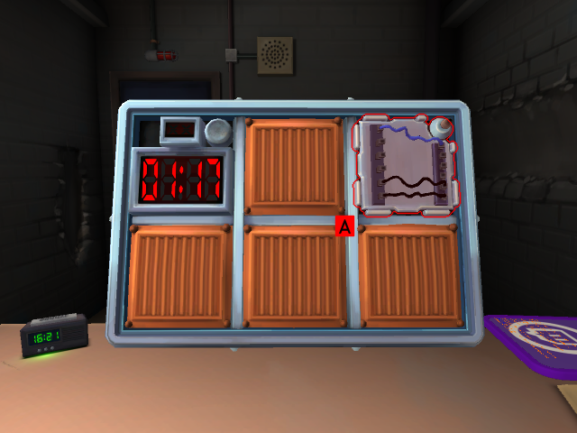

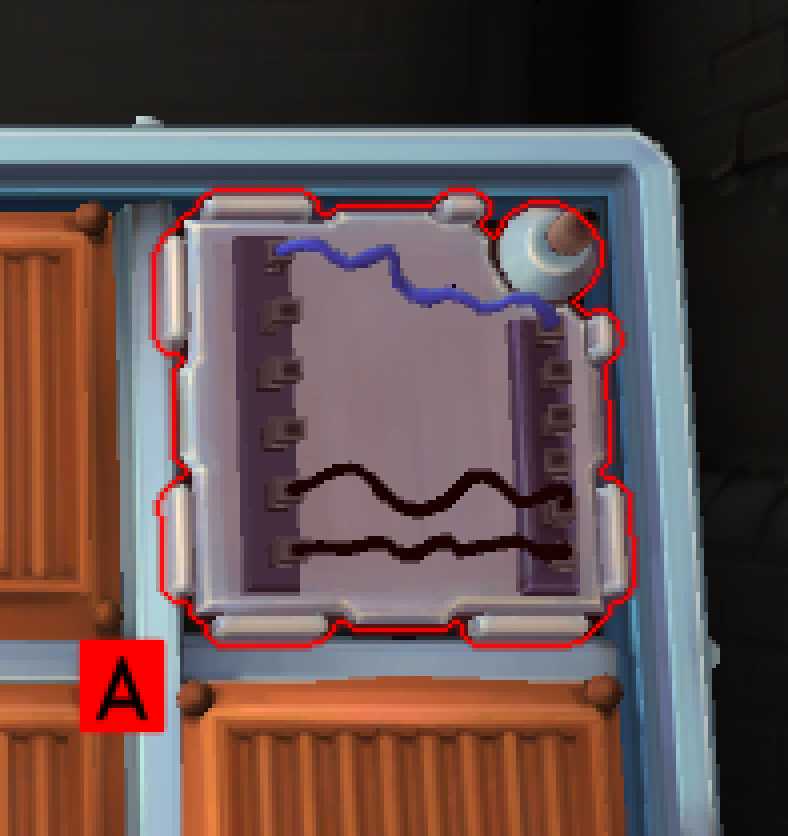

_(no cut image — no wire cut recorded)_

### CORRECT WIRE

position **3**, colour **black**

### DEFUSER MESSAGES

**Defuser #1**

```
I see the timer reading 01:18 and no red X strikes lit. Only one module visible on this face: a square panel with a light-gray background, red wires around the border, and three horizontal squiggly lines across it (top line blue, middle line black, bottom line black). There’s a small round gray component at the top-right of that panel. Tell me what info you need next (serial/batteries/ports/other sides or interact with this module).
```

**Defuser #2**

```
Front face currently in view shows the timer/strike display area on the left (red digital countdown; above it a small rectangular strike window), and one interactive module on the right: a square light-gray panel bordered by red wiring. On the panel are three horizontal wavy lines: top line is blue, middle line black, bottom line black. Along the left edge of the panel are small dark rectangular sockets/blocks in a vertical row. At the panel’s top-right corner is a small round gray knob/cap. The other four front-face slots are covered by orange vent-like plates.
```

**Defuser #3**

```
On this edge I see a single rectangular indicator labeled "SND" with a white light lit next to/behind the label. No other items visible on this edge, and no interaction markers are present here so I can’t click anything.
```

**Defuser #4**

```
I can’t see the serial number, batteries, or ports yet. So far I’ve found one lit indicator: label “SND” with a white light lit. I’m rotating around the bomb edges now to locate the serial label, battery holders, and port plates.
```

**Defuser #5**

```
Front face visible again. Timer reads 33:06, strikes display above timer is blank (0 strikes). Only active module on this face is the light-gray panel with red border wiring and three horizontal squiggles (top blue, middle black, bottom black) plus a small round gray cap at top-right; its status LED is not green. On edges so far I’ve seen two lit indicators: “SND” lit white and “CAR” lit white. Still have not located serial number, batteries, or ports.
```

**Defuser #6**

```
Timer 33:03, 0 strikes. Front face: only one unsolved module visible, a light-gray square bordered by red wiring with three horizontal wavy lines (top blue, middle black, bottom black) and a small round gray cap at the module’s top-right. Edge indicators found so far: SND lit white, CAR lit white. Still searching for serial number, batteries, and ports.
```

**Defuser #7**

```
<thought>I must include thoughts separately but output only JSON; however validator only accepts JSON. I will just send concise info without tags and continue rotations to find serial/batteries/ports.</thought>Timer now 18:10, 0 strikes. Still no serial/batteries/ports visible on this face. I’ll keep rotating to check edges for the serial label, battery holders, and port plates.
```

**Defuser #8**

```
Serial number label reads EU2C08.
```

**Defuser #9**

```
Serial number is EU2GQ8 (last character is Q then 8). No batteries or ports visible on this side.
```

**Defuser #10**

```
Outcome: the bomb exploded due to time running out. I (Defuser) spent most of the time rotating/looking for edge info (serial/indicators) and didn’t solve any modules; you (Expert) asked for key info early, but we never got to a full solve cycle.
Communication challenges: the biggest issue was format/tooling mismatch. I mixed in thought/action tags and sometimes provided multiple actions, which caused execution feedback errors and lost turns. I also attempted to click with an invalid location marker, which skipped a turn. These errors consumed time and prevented steady progress.
Mistakes/missed opportunities: (1) Not following the required “one JSON command only” format; the system feedback explicitly warned that extra text/actions were ignored. (2) Trying to interact on a side with no visible location markers; that led to invalid-marker attempts. (3) Spending too long searching for serial/batteries/ports instead of quickly returning to start solving the visible module, especially given the timer pressure. I recognized these as mistakes from the execution-feedback messages (invalid marker, multiple actions ignored) and the rapidly dropping timer.
What worked well: when I did report observations, the details were fairly clear (indicator labels, serial). What didn’t work: inefficient navigation (many rotations without a plan), and poor command formatting discipline.
Changes for next time: I would (1) strictly output only a single valid JSON command per turn, with no extra text; (2) prioritize immediate module identification and solving over exhaustive edge scouting—grab serial/batteries/ports in a quick, systematic sweep (e.g., four sides then top/bottom) and stop once essentials found; (3) only attempt clicks when a valid marker is visible; otherwise rotate/zoom out first; (4) send one concise “state packet” message containing timer, strikes, visible modules, and any edge info found so far.
Lessons learned: execution/formatting discipline is part of teamwork—tool errors waste more time than puzzle difficulty. Also, we need a shared search procedure (systematic edge sweep + immediate return to solving) and tighter, structured info exchange (timer/strikes/modules/serial/batteries/ports/indicators) to keep the Expert’s decision-making unblocked.
```

### EXPERT MESSAGES

**Expert #1**

```
What modules are visible on the bomb right now? Describe what you see on the front face.
```

**Expert #2**

```
I need to gather information about the bomb first. What is the serial number? How many batteries are on the bomb, and what type are they (AA or D)? What ports are present on the bomb?
```

**Expert #3**

```
**Game Outcome**: The bomb exploded due to timeout. We failed to solve any modules or gather complete bomb information.

**Communication Challenges**: I requested all bomb information (serial, batteries, ports) before starting the visible module, forcing you to search extensively while the timer ran. The serial number correction (EU2C08 → EU2GQ8) showed potential for misunderstandings.

**Critical Mistakes**:
- I should have immediately solved the visible 3-wire module using only the information at hand, rather than demanding complete bomb data first
- For the Wires module, I only needed to know if an empty port plate existed (since the last wire is black). I asked for everything instead of targeted questions
- I waited passively instead of guiding you to prioritize critical information
- Time was wasted on information gathering before any module was solved

**Strategies That Failed**: Gathering all information upfront before solving anything. This consumed too much time.

**Improvements for Next Attempt**:
1. **Solve immediately**: Start the visible module right away with available information
2. **Ask strategically**: Request only information critical to the current puzzle
3. **Work in parallel**: Solve modules while you search for additional bomb details
4. **Provide interim guidance**: Give instructions while you're gathering information rather than waiting
5. **Prioritize**: Focus on finding serial number first, then ports/batteries only as needed
6. **Be proactive**: Guide you on what to look for next instead of waiting passively

**Key Lesson**: Speed matters in this game. Start solving immediately with partial information, and gather additional details on-demand rather than upfront.
```

### CUTS

_(no cuts recorded)_

### RESULT

exploded

MY LABEL:

MY NOTE:


---

## async 813/1 · stock

**Game ID:** `async 813/1`  
**Condition:** stock

### TRUE WIRES

blue, white, blue

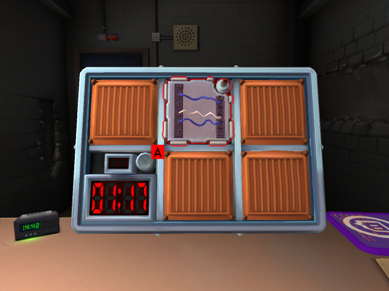


_(no cut image — no wire cut recorded)_

### CORRECT WIRE

position **2**, colour **white**

### DEFUSER MESSAGES

**Defuser #1**

```
I see one unsolved module: a rectangular panel with 3 horizontal wavy wires (top wire blue, middle wire white, bottom wire blue) running left-to-right into a vertical connector on the left. There’s also a small circular socket/knob at the panel’s top-right. Timer shows 0:17. No strike Xs visible. What should I do with this module?
```

**Defuser #2**

```
On this face I see only one puzzle module: a rectangular panel with 3 horizontal wavy wires (top blue, middle white, bottom blue) going into a vertical connector on the left; a small circular socket/knob at the panel’s top-right; status LED at the module’s top-right is not green. The rest of this face is blank vented plates plus the main timer display and the strike display above it (currently no red Xs). Timer currently reads 0:13. I don’t see any other modules on this face; I can rotate to check other sides if you want.
```

**Defuser #3**

```
Yes, wire colors are top blue, middle white, bottom blue. I rotated right and I’m now looking at a plain side panel; I do not see any port plate on this side (no cutouts/ports). Tell me which way to rotate/flip next to check other sides for ports/serial/batteries.
```

**Defuser #4**

```
I can’t cut a wire from this view; I’m currently looking at a blank narrow side (no modules, no ports/batteries/serial visible). I need to rotate back to the face with the wires module, then I can zoom into it and interact. Confirm I should rotate left twice to return to the wires face, then I’ll cut the middle (white) wire.
```

**Defuser #5**

```
1. Outcome: bomb defused successfully. I contributed by quickly identifying the module (3 wires: blue/white/blue), relaying the exact colors and strike status, navigating back to the module, and executing the cut. You contributed by recognizing the module from the description and giving the correct instruction to cut the middle (white) wire.
2. Communication challenges: I rotated away while you were ready to give an action, and you assumed I was still on the wires face. That mismatch briefly delayed execution and increased time pressure.
3. Mistakes/missed opportunities: My main mistake was continuing to rotate/check sides after you had enough info to solve the wires, which cost seconds. I recognized it when you urgently said to stop rotating and cut now, and because I had to explain I wasn’t on the module view. This could’ve been avoided by explicitly confirming “I am looking at the wires module now” before you issued the cut instruction, and by prioritizing solving before extra scouting when the timer is low.
4. What worked well: Clear, concrete visual description of wire colors and positions; you gave a single decisive action (“cut middle white”). What didn’t: context switching (rotating) without a shared confirmation of current view/state.
5. Next time: I’ll announce orientation changes and always confirm the active face/module before acting (“on wires module, ready to cut”). If time is low, we’ll solve the visible module first, then gather edge info (ports/batteries/serial) only if needed.
6. Lessons: Maintain shared situational awareness (what face we’re on, whether we’re zoomed in), use explicit confirmations before irreversible actions, and manage time by deferring nonessential exploration until after immediate solvable modules are cleared.
```

### EXPERT MESSAGES

**Expert #1**

```
I have the manual ready. What modules do you see on the bomb? Describe what's visible and we'll start solving them one at a time.
```

**Expert #2**

```
I see a Wires module. Before I give you instructions, I need to confirm: are those wire colors correct - blue on top, white in middle, blue on bottom? Also, does the bomb have an empty port plate on any of its sides?
```

**Expert #3**

```
Cut the middle wire (the white one).
```

**Expert #4**

```
Stop rotating - cut the middle white wire now. You have very little time left.
```

**Expert #5**

```
Yes, rotate left twice to get back to the wires module, then cut the middle white wire.
```

**Expert #6**

```
Excellent work! The bomb was successfully defused.

Reflecting on our performance:

1. **Outcome & Contribution**: We successfully disarmed the module by cutting the middle white wire. You provided accurate descriptions of the bomb, and I consulted the manual to determine the correct action.

2. **Communication Challenges**: There was a brief delay when you rotated to check for ports after I'd already given the cutting instruction. With only 13 seconds remaining, this created time pressure. However, you quickly understood the urgency and returned to execute the cut.

3. **Mistakes & Recognition**: The detour to check ports wasn't necessary - the 3-wire rule was already solvable from the wire colors alone (exactly one white wire = cut it). The timer's countdown made this clear as a mistake.

4. **What Worked Well**: Direct, concise instructions worked. Your willingness to act quickly under pressure was crucial. Confirming wire colors upfront prevented misunderstandings.

5. **Future Improvements**: I should have been more decisive earlier - with limited time, I could have immediately instructed you to cut the white wire without waiting for port information, since the rule didn't require it. You could prioritize cutting wires over exploring the bomb when time is critical.

6. **Key Lesson**: In time-pressured scenarios, act on sufficient information rather than seeking complete information. Speed matters as much as accuracy.
```

### CUTS

_(no cuts recorded)_

### RESULT

solved

MY LABEL:

MY NOTE:


---

## sync 234/1 · stock

**Game ID:** `sync 234/1`  
**Condition:** stock

### TRUE WIRES

blue, red, red, white, white, blue


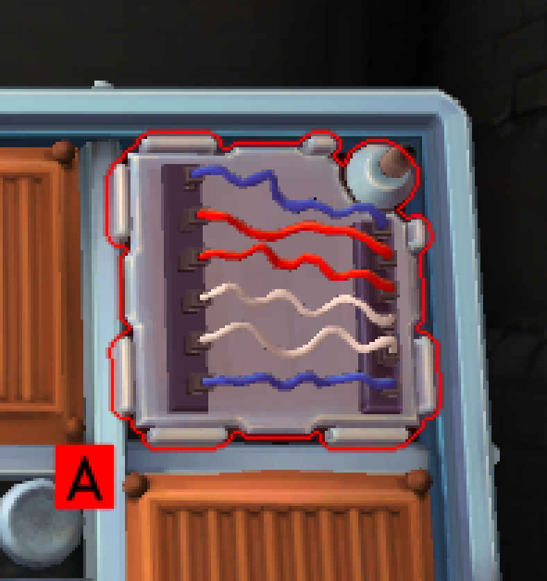

_(no cut image — cut step has no stored observation frame)_

### CORRECT WIRE

position **6**, colour **blue**

### DEFUSER MESSAGES

**Defuser #1**

```
I see one interactive module: a panel with 6 horizontal wires. From top to bottom the wire colors are red, red, blue, red, white, blue. Need serial number info to solve (also tell me if there are any batteries/indicators on the sides). Timer shows 01:17 and I see no red strike Xs.
```

**Defuser #2**

```
Right side: one battery holder with 2 batteries (two-cell pack). No indicator lights or serial number on this side.
```

**Defuser #3**

```
Found serial number label: 1FG7M4 (last character is 4). On this side also see the same 2-battery pack. No indicator lights. No ports visible on this side.
```

**Defuser #4**

```
Checked front and back faces: no ports on either face. I only saw the 2-battery pack on one side and serial 1FG7M4; still haven’t seen any ports yet.
```

**Defuser #5**

```
1) Outcome: bomb defused successfully. I provided the wire colors, serial number, and battery count; you used the manual logic to determine the correct wire to cut (6th/blue), which solved the module and ended the bomb.
2) Communication challenges: some ambiguity about which bomb faces can contain ports/serial, and I initially reported “no ports on front/back” rather than systematically checking every edge. Also I mistakenly interacted with the module zoom (clicked into it) before confirming all requested edge info, which cost time.
3) Mistakes/missed opportunities: I should have done a full edge sweep (all 4 sides + top/bottom edges) for ports/indicators/batteries/serial early, instead of partial checks. The sign this was a mistake was your repeated need for bomb-wide info to apply rules confidently. It could be avoided by using a standard checklist at the start: serial, batteries, indicators, ports, strikes, then module details.
4) What worked: concise wire description top-to-bottom and quickly confirming the serial’s last digit (even) and battery count enabled fast solving. What didn’t: my side-checking was not structured, leading to extra back-and-forth.
5) Next time: I’ll immediately report a complete ‘bomb profile’ in one message (serial, battery count, indicators with labels, port types, strikes, time) before diving into module actions, and I’ll confirm which side I’m viewing when reporting.
6) Lessons: shared checklists reduce ambiguity; give all prerequisite info upfront; keep module descriptions ordered (top-to-bottom/left-to-right); and avoid acting on a module until the expert confirms they have enough global bomb info to apply the manual rules safely.
```

### EXPERT MESSAGES

**Expert #1**

```
I can see a wire module with 6 wires. Before I give you instructions, I need information about the bomb itself. Can you tell me the serial number, and describe any batteries or indicator lights you see on the sides of the bomb?
```

**Expert #2**

```
I need to check the other sides of the bomb. Can you look at the left side, front, and back to find the serial number? Also, let me know if you see any ports on any side of the bomb.
```

**Expert #3**

```
For the wire module, cut the last wire (the 6th wire, which is blue). Before you do that, can you check the front and back of the bomb for any ports?
```

**Expert #4**

```
Cut the 6th wire from the top, which is blue.
```

**Expert #5**

```
Game Summary:

1. Outcome: The bomb was successfully defused on the first attempt with no strikes.

2. Communication: The Defuser provided accurate descriptions of the bomb components. Information gathering was done in stages (right side, then serial number, then front/back), which required multiple exchanges but ultimately provided all necessary details.

3. Mistakes/Missed Opportunities: None identified. The wire module solution was correct on the first attempt. The only inefficiency was gathering bomb information sequentially rather than all at once.

4. Strategies That Worked: Gathering complete bomb configuration (serial number, batteries, ports) before solving modules ensured I had all reference data available. Solving one module at a time maintained focus and clarity.

5. Future Improvements: The Defuser could provide all bomb information in a single message (all sides checked, all details listed) to reduce back-and-forth exchanges and save time on the countdown timer.

6. Key Lessons: Success depends on accurate, complete information transfer early. The Expert should ask for all relevant bomb details upfront rather than discovering them incrementally. Clear wire color identification and systematic rule application prevented errors.
```

### CUTS

- Cut 1: position **6**, colour **blue**, no strike

### RESULT

solved

MY LABEL:

MY NOTE:


---

## sync 561/2 · stock

**Game ID:** `sync 561/2`  
**Condition:** stock

### TRUE WIRES

blue, red, yellow, white


### CORRECT WIRE

position **4**, colour **white**

### DEFUSER MESSAGES

**Defuser #1**

```
Front face: timer shows 01:18. No red strike Xs visible above the timer. One module visible on the right: a panel with 6 wires total. From top to bottom the wires are: red, blue, yellow, red, black, white. There’s a small round light/LED at the top right of this module frame that is not green (looks unlit). Tell me which wire to cut.
```

**Defuser #2**

```
I cut the blue wire (2nd from top). Got 1 strike now (one red X above timer). Wire module status light is still not green. Timer now 01:08. What next? If you want other info, tell me what to check (serial/batteries/indicators/ports).
```

**Defuser #3**

```
Confirming current wires top to bottom: 1 blue, 2 blue (this one is cut), 3 yellow, 4 yellow, 5 white, 6 white. No red or black wires present on this module.
```

**Defuser #4**

```
Yes. The top blue wire has red striping. The lower blue wire (the cut one) looks solid blue. The two yellow wires look solid yellow. The two white wires look solid white.
```

**Defuser #5**

```
I’m on a blank side panel right now (no ports/serial/batteries visible on this face). I’ll keep rotating to find the serial label, batteries, and any port plates.
```

**Defuser #6**

```
Found one port plate on this side: a single D-shaped 9-pin serial-style port (looks like DB9). No other ports on this face. No batteries or serial number label visible on this face.
```

**Defuser #7**

```
Another side shows one port plate with a single D-shaped 9-pin serial-style port (DB9). Still no batteries or serial number label seen yet.
```

**Defuser #8**

```
Now seeing a different port plate: one D-shaped 9-pin serial-style port (DB9) again. Still no serial number label or batteries found yet; continuing search.
```

**Defuser #9**

```
Back to the face with the wires. Timer now 00:54, 1 strike still. I still have not found the serial number label or any batteries; only ports seen so far are 3 separate sides each with a single DB9 serial port. Do you want me to keep searching for serial/batteries/indicators, or go back to solving the wires? Current uncut wires: top wire blue with red stripes; then yellow, yellow, white, white.
```

**Defuser #10**

```
1. Outcome: the bomb exploded due to time running out. I contributed by cutting the wire you instructed and then searching for serial/ports/batteries; you contributed by giving the cut instruction and then requesting configuration info to re-evaluate. The single strike plus the time spent searching left us without enough time to recover.
2. Communication challenges: the biggest issue was inconsistent wire-color reporting. I first reported a 6-wire set including red/black, then later reported two blues/two yellows/two whites with a striped blue. That mismatch made it hard for you to apply the manual reliably and forced a reset of assumptions. Also, I didn’t immediately provide full bomb-edge info (serial/batteries/indicators) before the first cut, which limited your decision quality.
3. Mistakes/missed opportunities: (a) I likely misidentified wire colors initially (or didn’t notice striping), leading to an incorrect cut and a strike; the strike X was the feedback. Avoid by double-checking each wire carefully (including stripes) before any cut and by restating the full list once more for confirmation. (b) After the strike, we pivoted to searching for serial/batteries/ports, but I took multiple rotations without a systematic plan and we lost time; the timer dropping to under a minute was the sign. Avoid by doing a fast, structured sweep of all edges at the start (serial, batteries, indicators, ports) before interacting with modules.
4. What worked vs didn’t: worked—after the strike, we did the right thing by re-verifying wire details and asking about stripes, which is the correct diagnostic approach. Didn’t work—cutting before verification, and spending too long rotating without extracting the serial number/battery count quickly.
5. Changes next time: I would start by immediately reporting timer, strikes, serial number, battery count, indicator labels/lit status, and all ports before touching any module. For wires, I’d report count and each wire color top-to-bottom including stripe details, then ask you to confirm ‘ready to cut’ before acting. If searching edges, I’d do a consistent sweep: rotate 4 sides, then roll up/down, noting each face once to avoid repeats.
6. Lessons learned: accuracy beats speed—one wrong observation can cost more time than careful verification. Establish a shared ‘pre-flight checklist’ (serial/batteries/indicators/ports) and a ‘confirm-before-action’ rule for irreversible steps like cutting. Also, use concise, unambiguous descriptions (e.g., ‘blue with red stripes’ vs ‘blue’) to keep the manual mapping correct.
```

### EXPERT MESSAGES

**Expert #1**

```
Cut the second wire from the top, which is blue.
```

**Expert #2**

```
Let me verify the wire colors. Starting from the top wire and going down, can you confirm each color in order? I want to make sure we have them right before cutting another wire.
```

**Expert #3**

```
Do any of the remaining wires have stripes or multiple colors on them? For example, a wire that's mostly one color but has stripes of another color?
```

**Expert #4**

```
I need to check something. Can you tell me the serial number on the bomb and list all the ports and batteries you see on the sides of the bomb? This will help me understand the full bomb configuration.
```

**Expert #5**

```
<thought>
The user has checked most of the bomb and found:
- Three Serial ports (DB9) on different sides
- No serial number label found yet
- No batteries found yet

Timer is at 00:54 with 1 strike. We're running low on time. The user is asking whether to keep searching or go back to the wires.

I should focus on solving the wires now since time is critical. Let me reconsider the wire rules with the correct wire information:

Current wires (uncut):
1. Blue with red striping
2. Yellow
3. Yellow
4. White
5. White

Wait, the user said "top wire blue with red stripes; then yellow, yellow, white, white" - that's 5 wires total after cutting one. So the remaining wires are positions 1, 3, 4, 5, 6 from the original 6.

Original wire list was:
1. Blue with red striping
2. Blue solid (CUT)
3. Yellow
4. Yellow
5. White
6. White

For the 6-wire rules, I need to apply them based on the ORIGINAL configuration before any cuts:

6-wire rules:
1. If the last wire is blue, cut the last wire. → Last wire (6) is white. Doesn't apply.
2. Otherwise, if there is more than one white wire, cut the second wire. → There are two white wires (5, 6). This applies. Cut wire 2.

But wire 2 was already cut and caused a strike. So either:
1. My rule interpretation is wrong
2. The wire identification is still wrong
3. This isn't actually a standard wire module

Let me reconsider. The user said the second wire "looks solid blue" - maybe it's not actually blue? Or maybe the striped wire is being counted differently?

Actually, I wonder if the red striping on the first wire means it should be counted as a "red wire" for the purposes of the rules. Let me check the rules again:

"Otherwise, if there is more than one white wire, cut the second wire."

This doesn't mention red at all. It just checks if there's more than one white wire.

Hmm, but what if the presence of red striping on a wire means the rule about "more than one white wire" doesn't apply? Let me look at the rules more carefully...

Actually, I think I need to reconsider what counts as a "white wire" or "blue wire" etc. If a wire has red striping, does it count as a red wire or a blue wire?

Looking at the Complicated Wires module description: "Each wire may be striped with multiple colors." This suggests that striped wires are a thing, but in the basic Wires module, the rules don't seem to account for striping.

Let me think about this differently. The user got a strike when cutting the second wire (solid blue). The 6-wire rules say to cut the second wire if there is more than one white wire. We have two white wires, so the rule applies. But cutting the second wire caused a strike.

This suggests that either:
1. The rule doesn't apply (but the condition seems to be met)
2. The second wire is not actually the one we should cut
3. I'm misunderstanding what "second wire" means

Could "second wire" mean something other than position 2? Like "second of a certain type"? Let me reread the rules...

No, the rules for other wire counts use clear language like "the last wire," "the first wire," "the third wire," etc. They all refer to position.

I think the issue might be that I'm not correctly understanding whether the striped wire counts as a "blue wire" or something else.

Actually, let me reconsider the original rule application. The user initially said the wires were "red, blue, yellow, red, black, white" but then corrected to "blue with red striping, blue, yellow, yellow, white, white."

If the first wire is "blue with red striping," does it count as a blue wire or a red wire or both?

Looking at the 6-wire rules again, they check for:
- Blue wires (rule 1: "if the last wire is blue")
- White wires (rule 2: "if there is more than one white wire")
- Red wires (rule 3:
```

**Expert #6**

```
The bomb exploded when the timer reached zero at 00:54 remaining, with 1 strike already recorded.

**What Went Wrong:**

1. **Communication Failure**: You initially described the wires as "red, blue, yellow, red, black, white," but they were actually "blue with red striping, blue, yellow, yellow, white, white." I applied the 6-wire rules to incorrect data and instructed you to cut the second wire (solid blue), which caused a strike. The wire module light never turned green.

2. **Critical Mistake**: I did not verify wire colors before instructing the first cut. This was the fatal error. I should have asked you to carefully describe each wire before any action.

3. **Poor Time Management**: After the strike, instead of immediately asking you to re-confirm wire colors, I asked you to search the bomb for serial number, batteries, and ports. This wasted ~24 seconds of the remaining ~30 seconds. These details weren't needed for the wire module and should have been gathered only if necessary for other modules.

4. **Inefficient Recovery**: When a strike occurred, I should have immediately suspected my wire identification was wrong and asked for re-verification, not pursued tangential information.

**What Should Have Happened:**

Before ANY cut, I should have asked: "Can you describe each wire carefully, from top to bottom? Tell me the primary color and any stripes or secondary colors you see."

This would have prevented the strike entirely and saved the 20+ seconds spent on bomb reconnaissance.

**Lessons for Future Games:**

- Verify all critical input data before taking irreversible actions
- When a rule application fails, re-examine the input data first, not the rules
- Under time pressure, solve modules sequentially rather than gathering comprehensive bomb information first
- Prioritize accuracy over speed in cooperative games with penalties
```

### CUTS

- Cut 1: position **2**, colour **red**, strike

### RESULT

exploded

MY LABEL:

MY NOTE:


---

## sync 813/3 · stock

**Game ID:** `sync 813/3`  
**Condition:** stock

### TRUE WIRES

blue, white, blue

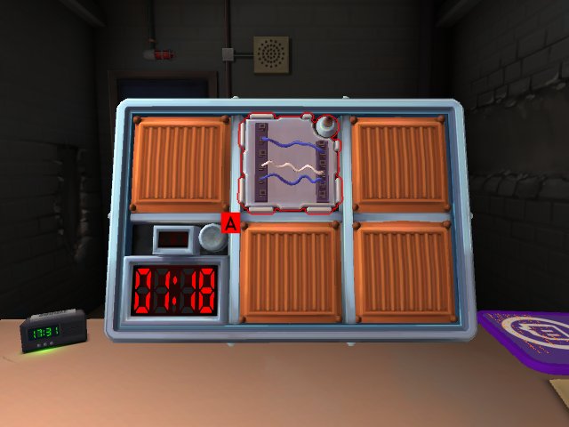

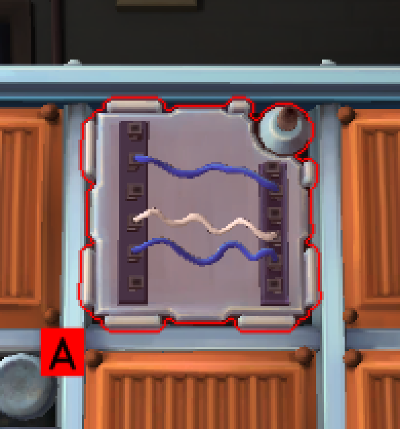

_(no cut image — no wire cut recorded)_

### CORRECT WIRE

position **2**, colour **white**

### DEFUSER MESSAGES

**Defuser #1**

```
Front face: timer shows 01:18. Strikes display above timer is blank (no red X). One module visible: a panel with 3 horizontal wavy wires (top blue, middle white, bottom blue) running left-to-right into connectors on both sides; there are 2 circular metal posts/terminals at the top right of this module. All other front panels are blank covers.
```

**Defuser #2**

```
Yes, correct: top wire is blue, middle wire is white, bottom wire is blue.
```

**Defuser #3**

```
Final outcome: bomb defused successfully. I contributed by quickly surveying the bomb, reporting the wire colors and strike status, and executing the requested cut. You contributed by mapping my description to the manual and giving the decisive instruction to cut the middle white wire.
Communication challenges: the biggest issue was precision/confirmation. You had to explicitly re-confirm the wire colors before giving the cut instruction, which was good, but it cost time. Also, I initially didn’t provide any other potentially relevant edge info (serial, batteries, indicators/ports) that could have mattered if the rule set required it.
Mistakes/missed opportunities: I made a process mistake by not including the required thought/reasoning format earlier (the system flagged it). In-game, I also clicked into the module again after cutting (unnecessary interaction) because I didn’t have immediate visual confirmation protocol in place. I recognized these as mistakes via the execution-feedback warning and because the extra click didn’t add information. Avoidance: stick to the required message format every turn; after an action, pause to observe and only interact again if the status LED/strike display needs checking.
What worked well: concise factual description of the module (top blue, middle white, bottom blue) and quick confirmation loop before acting. What didn’t: not front-loading all bomb-edge info and not explicitly stating “I am about to cut X now” before the interaction.
If playing again: I’d start by reporting timer, strikes, and immediately do a full edge sweep for serial/batteries/indicators/ports before solving. I’d also use a consistent call-and-response: you give an instruction, I repeat it back verbatim, then execute, then report status LED/strikes.
Lessons learned: confirmation prevents lethal miscuts; standardizing message structure reduces confusion; and minimizing unnecessary interactions saves time and lowers risk. A disciplined observe→report→confirm→act→verify loop improves reliability in collaborative defusal games.
```

### EXPERT MESSAGES

**Expert #1**

```
I see a module with 3 wires. Let me confirm the colors: you said top is blue, middle is white, and bottom is blue. Is that correct?
```

**Expert #2**

```
Cut the middle white wire.
```

**Expert #3**

```
Excellent work! The bomb was successfully defused. Here's my reflection on our teamwork:

1. **Final Outcome**: We achieved a perfect defusal with no strikes. You accurately described the wire module, and I correctly identified which wire to cut using the manual.

2. **Communication**: Our communication was clear and efficient. You provided specific details about wire colors and positions, which allowed me to apply the rules accurately without ambiguity.

3. **Mistakes**: There were no mistakes in this round. The key was your precise initial description of the module and my decision to confirm the wire colors before giving instructions, which eliminated any possibility of miscommunication.

4. **Strategies That Worked**: Confirmation before action was crucial. Rather than assuming I understood correctly, I asked you to verify the wire colors, which took minimal time but ensured accuracy. Your detailed description from the start prevented confusion.

5. **Future Improvements**: In a longer game with multiple modules, I would: (a) establish terminology early to speed up communication, (b) ask about bomb elements (ports, batteries, serial number) proactively when needed, and (c) manage time awareness by checking timer status periodically.

6. **Key Lessons**: Clarity and confirmation are worth the small time investment. Even seemingly obvious details should be verified when precision matters. This approach scales well to more complex puzzles.
```

### CUTS

_(no cuts recorded)_

### RESULT

solved

MY LABEL:

MY NOTE:


---

## sync 849/2 · stock

**Game ID:** `sync 849/2`  
**Condition:** stock

### TRUE WIRES

yellow, red, red, black, white, blue

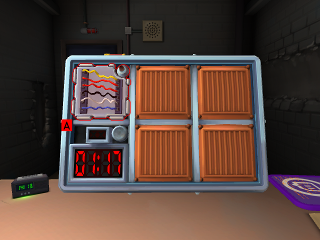

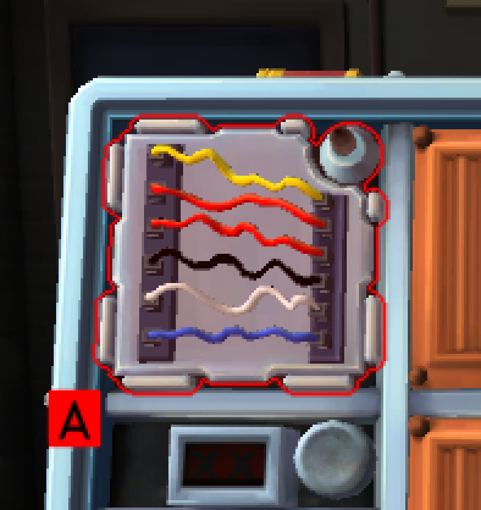

_(no cut image — cut step has no stored observation frame)_

### CORRECT WIRE

position **6**, colour **blue**

### DEFUSER MESSAGES

**Defuser #1**

```
Front face: one module visible on the left with 6 horizontal wires. From top to bottom the wire colors are: red, yellow, red, white, white, blue. No other symbols on the wires. Timer shows 01:17. Strike display above timer is blank (0 strikes). I can’t see serial/batteries/indicators/ports from this angle.
```

**Defuser #2**

```
Final outcome: bomb defused successfully. I contributed by quickly and clearly describing the 6 wires (top-to-bottom colors) plus time/strikes; you contributed by mapping that to the manual rule and giving the correct high-level instruction to cut the bottom blue wire.
Communication challenges: there was a small protocol mismatch. I initially spoke in terms of the wire position, but then I acted using the on-screen interaction markers, and I also used an incorrect action name once. This didn’t hurt the in-game solve, but it could have caused delay or errors in a stricter interface.
Mistakes/missed opportunities: I didn’t first zoom into the module before attempting interaction, and I used the wrong command vocabulary (I used “click”/marker logic inconsistently). The feedback that revealed this was the system execution-feedback noting missing “thoughts,” and the fact that the UI required specific interaction steps. To avoid this, I should follow the required interaction flow: zoom/activate module first, then interact with the specific wire, and keep command names consistent with the allowed schema.
What worked well: concise, complete wire description (all six colors in order) and you giving a direct actionable instruction (“cut 6th/bottom wire”). What didn’t: not confirming the exact interaction method before acting, and not asking for serial/battery info when it might have been needed (luckily it wasn’t for this rule).
If we played again: I’d standardize callouts (e.g., “wire 1–6 top-to-bottom”), confirm whether any extra bomb-edge info is required before acting, and I’d explicitly confirm I’m about to perform the instructed action (“cut wire 6 now”) to catch misunderstandings.
Lessons learned: tight, structured descriptions reduce manual-lookup time; always align on a shared referencing scheme (top-to-bottom indexing); and strict adherence to the interaction protocol prevents avoidable strikes or wasted time in collaborative real-time tasks.
```

### EXPERT MESSAGES

**Expert #1**

```
I can see a 6-wire module. The last wire is blue, so cut the 6th wire (the bottom one).
```

**Expert #2**

```
Excellent work! Here's my reflection on our game:

1. **Final Outcome**: We successfully defused the bomb without any strikes. You provided accurate information about the 6-wire module, I correctly identified that the last wire was blue and applied the appropriate rule, and you executed the cut flawlessly.

2. **Communication**: There were no significant communication challenges. Your description was precise and complete—you clearly listed all six wire colors in order, which gave me everything needed to solve the puzzle immediately.

3. **Mistakes**: None occurred. The straightforward nature of this scenario (a single module) meant there was little opportunity for error. Success came from accuracy in observation and execution.

4. **Strategies That Worked Well**: 
   - Your detailed, methodical description of the wires
   - My quick consultation of the manual and direct instruction
   - Minimal back-and-forth communication
   - Immediate action without unnecessary verification

5. **Future Improvements**: While this game went smoothly, in a multi-module scenario with time pressure, we should:
   - Prioritize gathering information about all bomb elements (serial number, ports, batteries) early
   - Work through modules systematically
   - Use concise language to save time
   - Maintain clarity even under time constraints

6. **Key Lessons**: Clear communication and complete information enable fast, accurate decision-making. In collaborative bomb defusal, precision in observation and instruction-following are critical. The role separation worked well—you focused on what you could see, I focused on applying the manual's logic.
```

### CUTS

- Cut 1: position **6**, colour **blue**, no strike

### RESULT

solved

MY LABEL:

MY NOTE:


---

## sync 960/3 · stock

**Game ID:** `sync 960/3`  
**Condition:** stock

### TRUE WIRES

white, yellow, white, blue, red, blue

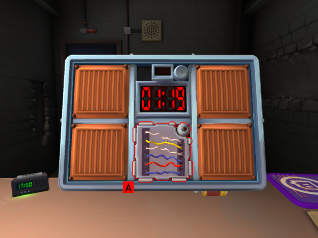

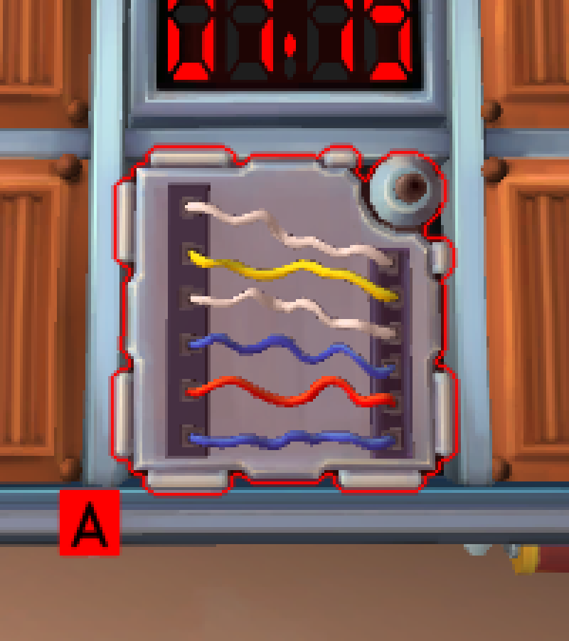

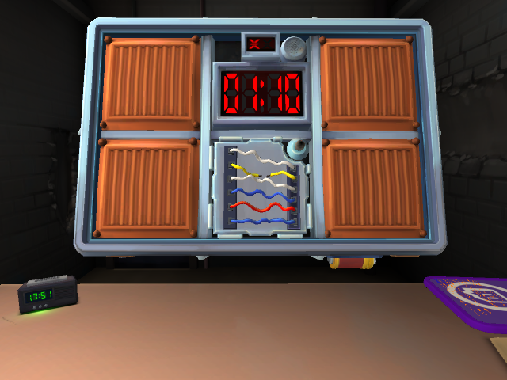

### CORRECT WIRE

position **6**, colour **blue**

### DEFUSER MESSAGES

**Defuser #1**

```
Front face: timer shows 01:19, no red X strikes visible. Only interactive module is a 6-wire panel: wires top-to-bottom are white, yellow, blue, black, red, red. There’s a small circular light/LED at the top-right of this module frame that is currently unlit/dim.
```

**Defuser #2**

```
I cut the 2nd wire (yellow). Got 1 strike (single red X above timer). Timer now 01:10. Remaining wires top-to-bottom: white, blue, black, red, red.
```

**Defuser #3**

```
Yes, confirmed: before the cut the 6 wires top-to-bottom were white, yellow, blue, black, red, red. Now the yellow (2nd) is cut; the others remain.
```

**Defuser #4**

```
Serial number label reads EA0DW4 (last character is 4). I don’t see any batteries or ports on this side; rotating to check other edges now.
```

**Defuser #5**

```
Found 1 port: a blue 9-pin D-sub/serial-style connector on one side. Still have not seen any batteries yet.
```

**Defuser #6**

```
Back at the wire panel. Timer now 00:59 with 1 strike showing. No batteries visible on the edges I checked so far; only port seen is the blue 9-pin D-sub. Serial EA0DW4.
```

**Defuser #7**

```
The cut wire (2nd from top) is definitely yellow (bright yellow, not orange). The bottom two wires are both red; they look the same shade to me (no obvious difference).
```

**Defuser #8**

```
1) Outcome: bomb exploded due to time running out after we took 1 strike on the wire cut and then spent remaining time gathering edge info. I contributed by reporting the initial wire order and later serial/port; you contributed by giving the cut instruction and then trying to recover by requesting serial/batteries/ports and re-verifying colors.
2) Communication issues: the key misunderstanding was the correct wire-cut rule application versus the wire order I provided. Also, I didn’t clearly separate “module view” vs “edge search” urgency; we pivoted to info-gathering but didn’t return to finishing the module in time.
3) Mistakes/missed opportunities: the biggest mistake was cutting the yellow wire based on an incorrect rule set for that exact configuration (6 wires: white/yellow/blue/black/red/red). We recognized it immediately from the strike indicator (single red X). Another missed opportunity was not collecting serial/battery/port info before making the first cut; that info often determines the correct cut. We could have avoided it by pausing before any cut to gather all bomb-wide info needed for wires, and by having you restate the rule you were using so I could sanity-check it.
4) What worked: my color confirmation and later re-confirmation helped ensure the data itself was consistent. Your quick attempt to re-verify colors and request global info was the right recovery move. What didn’t work: acting on a cut instruction without confirming prerequisites (serial parity, last digit, etc.) and spending too long rotating after time became critical.
5) Next time changes: before any irreversible action, I’ll proactively report serial number, battery count, and any visible ports/indicators first. I’ll also ask you to confirm whether your instruction depends on any of those factors. If time is low, we’ll commit to either finishing the current module immediately or not pivot midstream unless necessary.
6) Lessons: in collaborative defusal, accuracy beats speed on irreversible steps; gather prerequisites first, confirm shared assumptions explicitly, and use strikes/time feedback as a trigger to simplify—either finish the simplest remaining action or stop rotating and execute a clear plan.
```

### EXPERT MESSAGES

**Expert #1**

```
I see a 6-wire module. Cut the second wire from the top, which is yellow.
```

**Expert #2**

```
I got that wrong - my apologies. Let me recheck the original wire colors. You said the original wires were white, yellow, blue, black, red, red from top to bottom. Can you confirm those colors were correct before the cut?
```

**Expert #3**

```
I need more information about the bomb itself. Can you tell me: what is the serial number, how many batteries are on the bomb, and what ports are visible (if any)?
```

**Expert #4**

```
With time running short, I need to verify the wire colors very carefully. Can you describe the second wire again - the one you cut? Is it definitely yellow, or could it be orange or another color? Also, are the two bottom wires definitely both red, or could one be a different shade?
```

**Expert #5**

```
<thought>
The user confirms the colors are as I understood them. So my interpretation of the wire colors is correct. This means my logic must be wrong.

Let me reconsider the 6-wire rules from the manual one more time, reading very carefully:

"6 wires:
If the last wire is blue, cut the last wire.
Otherwise, if there is more than one white wire, cut the second wire.
Otherwise, if there is exactly one red wire, cut the third wire.
Otherwise, cut the second wire."

Original wires: white, yellow, blue, black, red, red

1. Last wire is blue? No, last wire is red. Rule 1 doesn't apply.
2. More than one white wire? No, only one white wire. Rule 2 doesn't apply.
3. Exactly one red wire? No, there are two red wires. Rule 3 doesn't apply.
4. Otherwise, cut the second wire.

By this logic, I should cut the second wire (yellow), which I did. But that caused a strike.

Wait... could I have misread the manual? Let me look at the image again. The user provided the manual text which says:

"6 wires:
If the last wire is blue, cut the last wire.
Otherwise, if there is more than one white wire, cut the second wire.
Otherwise, if there is exactly one red wire, cut the third wire.
Otherwise, cut the second wire."

That's what I've been reading. But I got a strike when I cut the second wire.

Hmm, could there be an issue with how I'm counting positions? The manual says "Wire ordering begins with the first on the top." So:
- Position 1 (top): white
- Position 2: yellow
- Position 3: blue
- Position 4: black
- Position 5: red
- Position 6 (bottom): red

The second wire from the top is yellow. I cut it and got a strike.

Wait - could the issue be that I'm misunderstanding what "the last wire" means? Could "last" mean something other than the bottom wire? Let me re-read: "Wire ordering begins with the first on the top." This clearly establishes that the first is on top, so the last should be on bottom.

I'm quite confused. Let me think about whether there could be an error in my reading of the original colors. The user said: "wires top-to-bottom are white, yellow, blue, black, red, red"

Could the second wire actually not be yellow? Could I have misread? Let me ask the user to list them again by position number to be absolutely sure.

Actually, wait. Let me reconsider the rules one more time. What if "more than one white wire" in rule 2 should actually be checked differently? Or what if I'm misunderstanding the logic of the if-then statements?

The rules are:
1. If last wire is blue → cut last wire
2. Otherwise, if more than one white wire → cut second wire
3. Otherwise, if exactly one red wire → cut third wire
4. Otherwise → cut second wire

These are sequential checks. If condition 1 is true, you cut the last wire and stop. If condition 1 is false but condition 2 is true, you cut the second wire and stop. Etc.

Original: white, yellow, blue, black, red, red
- Condition 1: Is last wire blue? No (it's red).
- Condition 2: Are there more than one white wire? No (only one).
- Condition 3: Is there exactly one red wire? No (there are two).
- Condition 4: Otherwise. Yes, this applies. Cut the second wire.

I cut the second wire (yellow) and got a strike.

The only way this makes sense is if:
1. I miscounted the position (but the user confirmed it's the second from top)
2. I misidentified the color (but the user confirmed it's yellow)
3. I misread the manual (but I have it right in front of me)
4. There's something else affecting the puzzle that I don't know about

Actually, wait. Could there be other modules on the back of the bomb that I haven't seen? The user said "Only interactive module is a 6-wire panel" on the front face. But they haven't checked the back yet. Could there be something on the
```

**Expert #6**

```
The bomb exploded at 00:59 with 1 strike remaining. Here's my reflection:

**Final Outcome:** We failed to solve the wire module in time. I made an incorrect decision that consumed our one safety strike, then spent remaining time verifying information rather than acting.

**Communication Challenges:** When I received the strike, I should have immediately instructed you to try the next logical wire option instead of asking for color verification. With <1 minute remaining, verification questions wasted critical seconds.

**Key Mistakes:** (1) My wire analysis was wrong—I cut the 2nd wire based on the 6-wire rules, but this caused a strike, indicating either a misreading of the manual or miscounting. (2) After the strike, I didn't pivot quickly enough. Instead of immediately trying the 3rd wire, I asked you to verify colors. (3) I spent time gathering bomb information (batteries, ports) that didn't apply to the wire module, consuming time we didn't have.

**What Worked:** Clear descriptions from you about bomb details. Systematic approach to gathering information.

**What Failed:** Slow decision-making under time pressure. No backup strategy after the first strike.

**For Next Time:** (1) After a strike, immediately try the next logical solution rather than re-verify. (2) Prioritize speed over caution when time is critical. (3) Ask only essential questions. (4) Have alternative wire positions ready to try in sequence. (5) I should re-examine the wire manual more carefully to understand where my interpretation failed.
```

### CUTS

- Cut 1: position **2**, colour **yellow**, strike

### RESULT

exploded

MY LABEL:

MY NOTE:


---

## async 234/2 · overlay

**Game ID:** `async 234/2`  
**Condition:** overlay

### TRUE WIRES

blue, red, red, white, white, blue

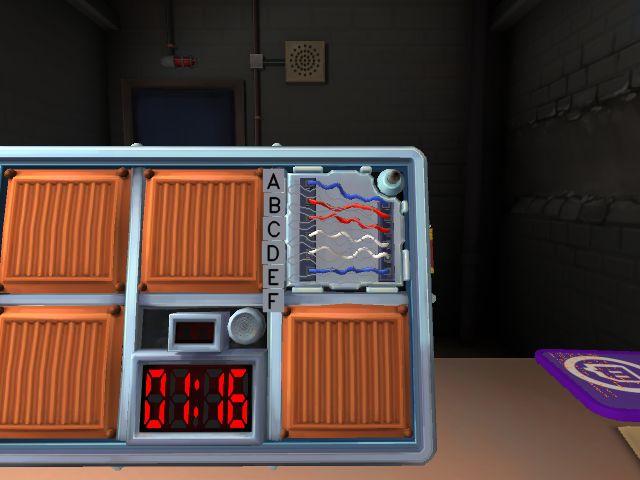

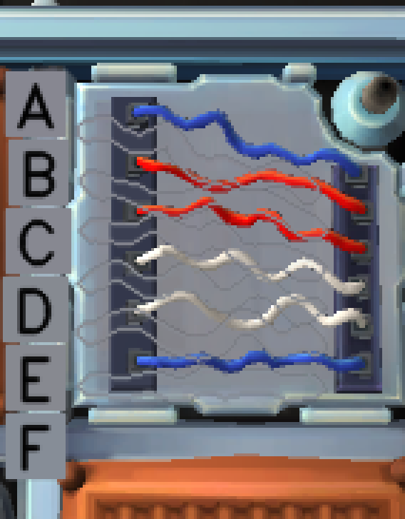

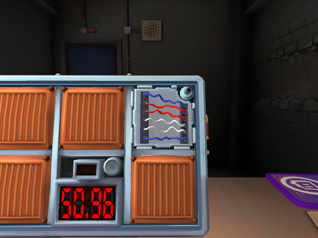

### CORRECT WIRE

position **6**, colour **blue**

### DEFUSER MESSAGES

**Defuser #1**

```
Zoomed in on the module with 6 horizontal wires. From top to bottom: 1) blue, 2) red, 3) red, 4) white, 5) white, 6) blue. No wires cut yet. Timer shows 01:16, no red X strikes visible.
```

**Defuser #2**

```
I’m currently zoomed in on one module only: a panel with 6 horizontal wires (top to bottom: blue, red, red, white, white, blue). No wires cut. I can’t see any other modules or any edge info (serial/batteries/ports/indicators) from this zoomed view. Tell me if you want me to zoom out to the full bomb to report everything.
```

**Defuser #3**

```
Full front view: only 1 module visible, top-right, the 6 horizontal wires (top to bottom: blue, red, red, white, white, blue). All other front panels are blank covers. Timer reads 01:08. I don’t see any strikes (no red Xs above timer). No edge info (serial/batteries/ports/indicators) visible from this view; I need to rotate/roll to check edges and the other side.
```

**Defuser #4**

```
Yes: it’s only 6 horizontal colored wires across the panel. No buttons, no symbols/text under the wires. There is a small status LED in the module’s top-right corner (currently not lit/green). Also a small circular fixture at the module’s top-left (looks like a screw/light, not interactive). Nothing else on that module.
```

**Defuser #5**

```
Wire 1 (top): blue. Wire 2: red. Wire 3: red. Wire 4: white. Wire 5: white. Wire 6 (bottom): blue.
```

**Defuser #6**

```
Wire 1: blue. Wire 2: red. Wire 3: red. Wire 4: white. Wire 5: white. Wire 6: blue.
```

**Defuser #7**

```
Cutting wire 6, the bottom blue one.
```

**Defuser #8**

```
Yes, wire 6 (bottom blue) is now cut. No strike X appeared (still 0 strikes). The module’s status LED in the top-right of that module is still not glowing green, so it does NOT look solved yet.
```

**Defuser #9**

```
1) Outcome: bomb defused successfully. You contributed by identifying the module type (Wires) and giving the cut instruction; I contributed by accurately reading wire colors, executing the cut, and reporting strike/LED status.
2) Communication challenges: I stayed zoomed in initially, so I couldn’t provide edge info (serial/batteries/ports/indicators) when you asked. Also, I sent one action (cut) before explicitly confirming I was about to do it in the exact step-by-step cadence you wanted, which created uncertainty about whether the cut had happened.
3) Mistakes/missed opportunities: I should have proactively rotated/rolled earlier to gather serial/battery/indicator/port info since it’s commonly needed, instead of waiting. I also should have confirmed the module was still active/zoomed before taking the cut action, and then immediately reported the result without being prompted. I recognized these as issues because you had to re-ask for close wire confirmation and later asked whether the cut had occurred.
4) What worked: clear top-to-bottom wire readouts, and your concise “cut wire 6” instruction. What didn’t: delaying global bomb info collection and not maintaining a consistent “confirm then act then report” rhythm.
5) Next time: I’d do a quick full sweep first (front/back + all edges) to capture serial, batteries, indicators, and ports, then tackle modules. For each action, I’d follow a strict loop: restate intended action in one line, perform it, immediately report LED/strikes/time and any changed state (e.g., which wires are cut).
6) Lessons: front-load shared context (edge info), use consistent call-and-response for risky actions, and always report objective feedback (status LED/strike display) right after interactions to avoid ambiguity and rework.
```

### EXPERT MESSAGES

**Expert #1**

```
I have the manual. Describe what you see on the bomb—what modules are visible and what information appears on the edges (serial number, batteries, ports, indicators)?
```

**Expert #2**

```
Before I give you instructions, I need to confirm: does this module have only horizontal colored wires, with an LED above them? Are there any buttons, flashing lights, symbols under the wires, or anything else on this module besides the wires?
```

**Expert #3**

```
This is the Wires module. Before I solve it, I need a fresh close look at each wire. Starting from the top, tell me the color of each wire one at a time: Wire 1 color? Wire 2 color? And so on through wire 6.
```

**Expert #4**

```
Good. Now zoom in on the 6-wire module again. Tell me the color of each wire from top to bottom, one wire at a time: Wire 1? Wire 2? Wire 3? Wire 4? Wire 5? Wire 6?
```

**Expert #5**

```
Cut wire 6, the blue one.
```

**Expert #6**

```
Have you cut wire 6 yet? If so, is the module's status light now green, and did the strike count stay the same?
```

**Expert #7**

```
Bomb successfully defused. The mission is complete. The Wires module was solved efficiently: you provided clear wire color descriptions, I identified that the last wire was blue, and we applied the correct rule without requiring additional bomb information. No strikes occurred. Effective communication and precise visual reporting from you made the solution straightforward.
```

### CUTS

- Cut 1: position **6**, colour **blue**, no strike

### RESULT

solved

MY LABEL:

MY NOTE:


---

## async 234/3 · overlay

**Game ID:** `async 234/3`  
**Condition:** overlay

### TRUE WIRES

blue, red, red, white, white, blue


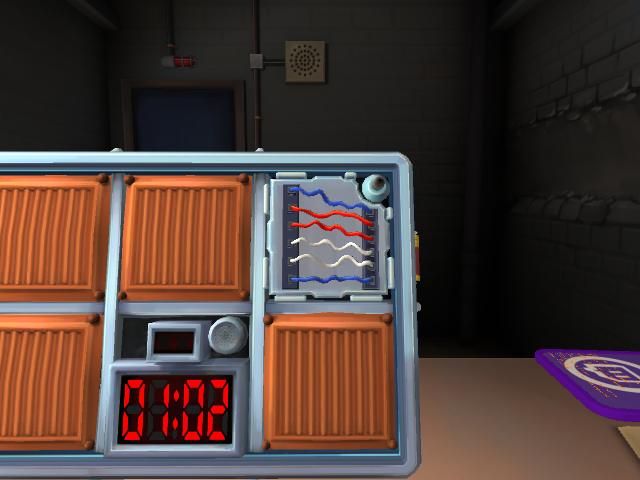

### CORRECT WIRE

position **6**, colour **blue**

### DEFUSER MESSAGES

**Defuser #1**

```
I see one unsolved module on this face: a panel with 6 horizontal wires (top to bottom: red, red, blue, white, white, blue). Timer shows 01:17. No red X strikes visible. I need to zoom into the wire panel to report ports/serial/batteries if you need—tell me what info you want first.
```

**Defuser #2**

```
Visible face: 1 interactive module is a wire panel in the top-right with 6 horizontal wires (top to bottom: red, red, blue, white, white, blue) and its status light is not green (unsolved). The other 5 large orange panels look like blank covers (no controls). Timer reads 01:13. Strike display above timer is clear (0 strikes). No serial number/batteries/ports/indicators visible from this angle.
```

**Defuser #3**

```
Zoomed wire panel, top to bottom: wire 1 blue, wire 2 red, wire 3 red, wire 4 white, wire 5 white, wire 6 blue.
```

**Defuser #4**

```
Cutting wire 6, the bottom blue one, now.
```

**Defuser #5**

```
I clicked the bottom blue wire (wire 6). Wire 6 is now cut. Module status light is still not green. Strike display still shows 0 red Xs.
```

**Defuser #6**

```
Current wire panel state: wire 1 blue intact, wire 2 red intact, wire 3 red intact, wire 4 white intact, wire 5 white intact, wire 6 blue is cut. Module light still not green, 0 strikes.
```

**Defuser #7**

```
1) Outcome: bomb defused successfully. I contributed by quickly locating the only active module on that face, zooming in, reading wire colors, and executing the instructed cut while monitoring strikes/module light. You contributed by using the manual to choose an action (cut wire 6) and by requesting confirmation checks (light/strikes).
2) Communication challenges: early on I reported the wire order from the overview (red, red, blue, white, white, blue) then after zooming I corrected it to blue, red, red, white, white, blue. That mismatch could have led to a wrong cut if you’d acted on the first report. Also, I acted (cut) before you repeated the instruction a second time, which risked desync.
3) Mistakes/missed opportunities: my main mistake was giving a wire order before zooming, then having to correct it. I recognized it as a mistake because the zoomed-in view clearly showed a different top wire color than my first callout. Another missed opportunity was not immediately rotating to gather serial/batteries/ports info; that could have been needed depending on the wire rules. Avoidance: always zoom before describing module details; when a module might depend on edge info, proactively collect serial/battery/indicator data before cutting.
4) What worked: concise readback of the intended action (“Cutting wire 6…”) and immediate reporting of results (wire cut, light not green, 0 strikes). Asking for explicit confirmation checks helped. What didn’t: any description from the overview and any action taken before both sides were fully aligned on the current state.
5) Next time changes: I will (a) zoom first, then report top-to-bottom wire colors; (b) explicitly state the current cut state before and after any cut; (c) if the manual might require bomb-edge info, I’ll rotate early to capture serial number, batteries, indicators, and ports before any irreversible action; (d) wait for a clear “cut X” instruction after the final confirmed wire order.
6) Lessons: precision beats speed—especially with irreversible actions. Establish a shared protocol: zoom → describe → confirm → read back → act → report outcome. Also, treat any discrepancy (like a changed wire order) as a stop signal to re-verify rather than pushing forward.
```

### EXPERT MESSAGES

**Expert #1**

```
I have the manual ready. What do you see on the bomb? Start by telling me what modules are visible and any other details you can see.
```

**Expert #2**

```
Zoom into the wire module and confirm each wire color carefully, starting from the top. Tell me the color of wire 1, wire 2, wire 3, wire 4, wire 5, and wire 6.
```

**Expert #3**

```
Cut the last wire—the blue one at the bottom (wire 6). Is the module's light green, and did the strike count stay at 0?
```

**Expert #4**

```
Thank you for zooming in. The order is now clear: blue, red, red, white, white, blue. Cut the last wire—wire 6, the blue one at the bottom. Is the module's light green, and did the strike count stay at 0?
```

**Expert #5**

```
The module should have solved but didn't. Let me verify: are there any other wires already cut on this panel? And can you confirm wire 6 shows as cut now?
```

**Expert #6**

```
Hold on—I need to verify the bomb is actually defused. Did you receive a victory message or confirmation from the game? We've only solved one module on one face. Check the other faces of the bomb for any unsolved modules (those without a bright green status light). What do you see?
```

### CUTS

- Cut 1: position **6**, colour **blue**, no strike

### RESULT

solved

MY LABEL:

MY NOTE:


---

## async 561/1 · overlay

**Game ID:** `async 561/1`  
**Condition:** overlay

### TRUE WIRES

blue, red, yellow, white


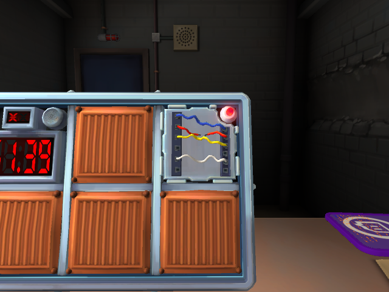

### CORRECT WIRE

position **4**, colour **white**

### DEFUSER MESSAGES

**Defuser #1**

```
Front face: timer shows 01:19. No red X strikes visible above the timer. One module present at top-right: a panel with 6 horizontal wires and a small unlit status light at the module’s top-right. Wire colors top-to-bottom: red, blue, yellow, black, white, white. I have not interacted with it yet.
```

**Defuser #2**

```
Front face: timer reads 01:16. No red X strikes visible above the timer. Only one module visible on the front: top-right is a wire panel with 6 horizontal wires. Wire colors top-to-bottom: red, blue, yellow, black, white, white. The module’s small status light at its top-right is not green (appears unlit/dim).
```

**Defuser #3**

```
Front face: timer reads 01:10. No red X strikes visible. One module visible top-right: wire panel with 6 horizontal wires, colors top-to-bottom red, blue, yellow, black, white, white. Status light at module top-right is unlit/dim (not green).
```

**Defuser #4**

```
Top wire (1st from top) is blue.
```

**Defuser #5**

```
Top-to-bottom wire colors (zoomed): 1st blue, 2nd red, 3rd yellow, 4th white, 5th white, 6th white.
```

**Defuser #6**

```
Wire A (top/1st) is blue.
```

**Defuser #7**

```
From top to bottom: 1st blue.
```

**Defuser #8**

```
2nd wire is red.
```

**Defuser #9**

```
Cutting B, the red one.
```

**Defuser #10**

```
Red wire (2nd from top) cut. Got 1 strike (one red X above timer). Module status light is still not green.
```

**Defuser #11**

```
Remaining uncut wires top-to-bottom now: 1st blue, 3rd yellow, 4th white, 5th white, 6th white. Red (2nd) is cut. Timer now 01:07 with 1 strike showing.
```

**Defuser #12**

```
Timer now 00:27, still 1 strike. Wire panel still unsolved. Current wires top-to-bottom: 1st blue (uncut), 2nd red (cut), 3rd yellow (uncut), 4th white (uncut), 5th white (uncut), 6th white (uncut). Tell me which wire to cut next.
```

**Defuser #13**

```
Wire 1 at the very top is blue.
```

**Defuser #14**

```
Wire 2 (second from top) is blue.
```

**Defuser #15**

```
Wire 3 is red.
```

**Defuser #16**

```
From the image: topmost uncut wire is blue.
```

**Defuser #17**

```
Looking at the module now: there are 6 wires. Top two are blue. Third is red and it is cut. Fourth is yellow. Fifth is white. Sixth is white.
```

**Defuser #18**

```
There are 6 wires still visible (one of them is cut in the middle). The 2nd wire from the top is blue.
```

**Defuser #19**

```
Current visible wires top-to-bottom: 1st blue, 2nd blue, 3rd red (this one is cut), 4th yellow, 5th white, 6th white. 1 strike still showing.
```

**Defuser #20**

```
Timer now shows 00:06 with 1 strike. Wire panel still unsolved; wires visible top-to-bottom: blue, blue, red (cut), yellow, white, white.
```

**Defuser #21**

```
Wire 1 (top) is blue.
```

**Defuser #22**

```
Wire 2 is blue.
```

**Defuser #23**

```
Cutting wire 2, the blue one.
```

**Defuser #24**

```
Cut the 2nd wire (blue). No new strike appeared (still 1 strike). Module status light still not green.
```

**Defuser #25**

```
1) Outcome: the bomb exploded due to time running out. I contributed by giving inconsistent wire-color reports and spending too long messaging; you contributed by trying to re-check the manual logic after the strike, but we ran out of time before converging on a correct cut sequence.
2) Communication issues: I contradicted myself about the wire order (initially red/blue/yellow/black/white/white, later blue/red/yellow/white/white/white, then even two blues). That made it impossible for you to apply the manual reliably and led to hesitation and re-asking, which burned the clock.
3) Mistakes/missed opportunities: My biggest mistake was not following a strict, repeatable observation method after zooming in (and after the first cut). The strike after cutting the red wire was clear feedback something was wrong, and the repeated contradictions were another sign. We could have avoided this by: (a) immediately re-reading all 6 wires from the live zoomed view in one pass, (b) explicitly stating which wire was cut and its position, (c) not changing earlier claims without saying “I rechecked and I was wrong.”
4) What worked: You asked for one-at-a-time confirmation, which is the right approach. What didn’t: my reporting wasn’t stable, and we didn’t switch to a faster fallback (e.g., I should have taken a single careful full-sequence read and stuck to it).
5) Next time: I will always zoom first, then read wires top-to-bottom slowly and consistently, then repeat the full sequence once to confirm before any cut. After any cut/strike, I’ll immediately report: time, strikes, which position is cut, and the remaining sequence. I’ll also avoid extra messages; only answer exactly what you ask.
6) Lessons: In collaborative puzzle games, consistency beats speed—incorrect observations cost more time than careful verification. After an error, reset with a clean re-observation and a shared “current state” snapshot before making the next move.
```

### EXPERT MESSAGES

**Expert #1**

```
What do you see on the bomb? Start by describing any modules visible on the front face.
```

**Expert #2**

```
I see a 6-wire module. Before I tell you which wire to cut, zoom in on the module and confirm each wire color from top to bottom, one at a time. What color is the first wire at the top?
```

**Expert #3**

```
I see a 6-wire module. Before I tell you which wire to cut, zoom in on the module and confirm each wire color from top to bottom, one at a time. What color is the first wire at the top?
```

**Expert #4**

```
What color is wire A, the first one at the top?
```

**Expert #5**

```
I need to clarify. You initially said the top wire was red, but now you're saying it's blue. Let me confirm the full sequence again. Starting from the very top wire and moving down, what color is each wire? Go one at a time.
```

**Expert #6**

```
Cut wire B, the red one.
```

**Expert #7**

```
We got a strike. Let me re-examine this carefully. The red wire was wrong. Look at the module again and tell me each wire color from top to bottom, one at a time, starting fresh. What is wire 1 at the very top?
```

**Expert #8**

```
We made an error. Let me re-examine the remaining wires very carefully. Look at each uncut wire and describe its color precisely. Start with the topmost uncut wire: what exact color is it?
```

**Expert #9**

```
I need to clarify. You said wire 2 is both red (cut) and blue. Can you describe what you see: after cutting the red wire, how many wires are currently visible on the module? And what color is the wire in the second position from the top right now?
```

**Expert #10**

```
I need to be absolutely certain before we cut another wire. You've described the sequence differently a few times. Let me verify the current state: looking at the 6 wires on the module right now, tell me the color of each wire from top to bottom, one at a time. Start with wire 1 at the very top.
```

**Expert #11**

```
Cut wire 2, the blue one.
```

**Expert #12**

```
Cut wire 2 now, the second blue wire from the top.
```

**Expert #13**

```
The module should be solved after cutting one wire, but it's not green yet. Are there any other modules visible on the bomb besides this wire panel? Check all faces of the bomb.
```

**Expert #14**

```
**Game Outcome**: The bomb exploded due to time running out at 00:06 with 1 strike. The wire module was never solved.

**Communication Challenges**: Wire colors were described inconsistently—first as "red, blue, yellow, black, white, white," then "blue, red, yellow, white, white, white," then finally "blue, blue, red, yellow, white, white." This confusion consumed critical time. Additionally, when I said "cut wire B," you cut the 3rd wire instead of the 2nd, suggesting ambiguity about wire labeling.

**Critical Mistakes**: (1) I instructed you to cut wire 2 (red) without properly verifying the sequence first, causing a strike. (2) I didn't follow the grounded repair protocol—I should have confirmed each wire individually before any instruction. (3) After cutting wire 2 (blue) without solving the module, I didn't immediately recognize this was anomalous and wasted time asking about other modules.

**What Didn't Work**: Asking for the full sequence upfront, rushing to give instructions under time pressure, and not catching inconsistencies early enough.

**Future Improvements**: (1) Always verify wires one-by-one using position numbers ("position 1, position 2") not labels. (2) After any strike, completely restart analysis. (3) Recognize anomalies immediately—if cutting a wire doesn't solve the module or cause a strike, something is wrong. (4) Prioritize accuracy over speed, even with low time remaining. (5) Use clearer communication about physical positions to eliminate confusion.

**Key Lesson**: Proper verification takes time upfront but prevents cascading errors. Rushing led to multiple mistakes that consumed more time than careful initial confirmation would have.
```

### CUTS

- Cut 1: position **2**, colour **red**, strike

### RESULT

exploded

MY LABEL:

MY NOTE:


---

## async 561/2 · overlay

**Game ID:** `async 561/2`  
**Condition:** overlay

### TRUE WIRES

blue, red, yellow, white


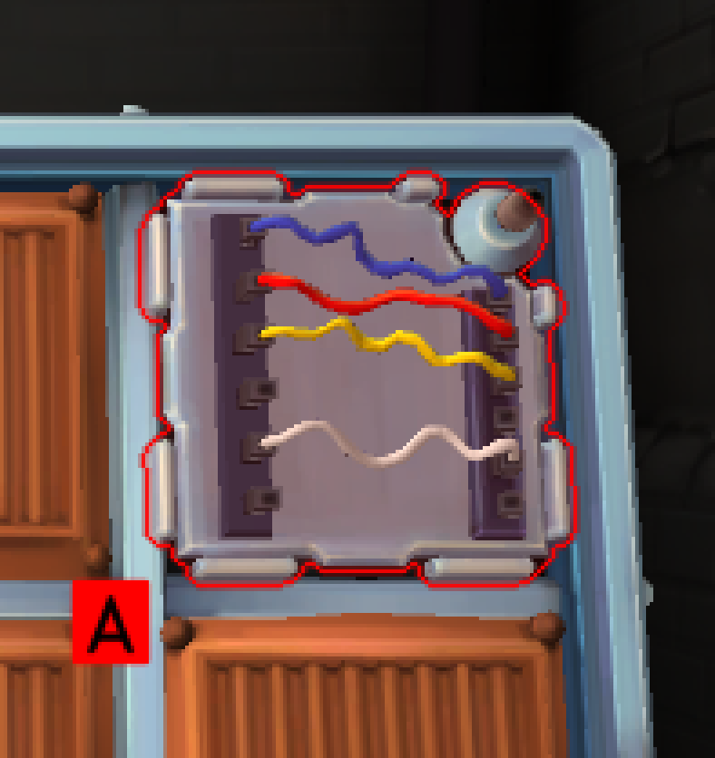

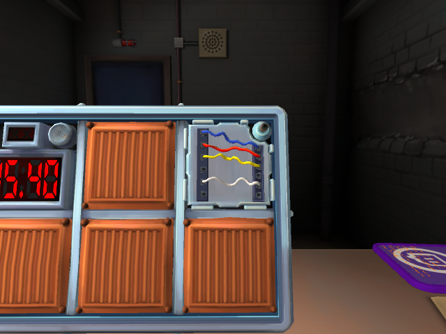

### CORRECT WIRE

position **4**, colour **white**

### DEFUSER MESSAGES

**Defuser #1**

```
I see one module on this face: a panel with 6 horizontal wires in one column. From top to bottom the wire colors are: red, blue, yellow, black, white, white. No wires are cut. I also see the timer reading 01:19 and no red strike Xs showing.
```

**Defuser #2**

```
Front face: timer shows 01:16, strikes display is blank (0 strikes). One unsolved module present: a panel with 6 horizontal wires. From top to bottom the wire colors are red, blue, yellow, black, white, white. No wires are cut. I don’t currently see the serial number, batteries, indicators, or ports from this view.
```

**Defuser #3**

```
I’m not zoomed in on the wires yet, so I can’t safely confirm which one is wire 2. Please wait while I zoom in; then I’ll read back “Cutting wire 2, blue” and cut it.
```

**Defuser #4**

```
Zoomed in. There are 4 wires (not 6). From top to bottom: wire 1 blue, wire 2 blue, wire 3 yellow, wire 4 white. No wires are cut.
```

**Defuser #5**

```
Timer now shows 00:56. Strikes display still blank (0 strikes). Awaiting which wire to cut.
```

**Defuser #6**

```
Confirmed: definitely 4 wires. From top to bottom: wire 1 blue, wire 2 blue, wire 3 yellow, wire 4 white. None are cut.
```

**Defuser #7**

```
Timer reads 00:29, still 0 strikes. Tell me which wire number to cut.
```

**Defuser #8**

```
Cut wire 4 (bottom white). No strike appeared. Module status light is now bright green (solved). Timer shows 00:10.
```

**Defuser #9**

```
1) Outcome: bomb defused successfully with ~00:10 left. You contributed by using the manual to decide the correct cut (wire 4). I contributed by carefully re-checking the wire count/colors and executing the cut, then confirming no strike and the green solve light.
2) Communication challenges: I initially reported 6 wires from the overview, but after zooming in it was actually 4. That mismatch could have led to wrong manual logic and a strike. It also created delay because we had to stop and re-verify.
3) Mistakes/missed opportunities: My main mistake was describing wire details before zooming, which violated the safest workflow and produced incorrect info. The sign it was wrong was the zoomed-in view clearly showing only 4 wires and different colors. It could’ve been avoided by always zooming before reporting any wire count/colors and by immediately stating “I must zoom to confirm” instead of giving an overview-based description.
4) What worked well: We paused to resolve the inconsistency, reconfirmed top-to-bottom wire colors, and waited for explicit instruction before cutting. What didn’t: rotating/acting without a clear plan early on and sending extra timer updates instead of focusing on getting the needed decision quickly.
5) Next time changes: I will always zoom first, then give a single precise top-to-bottom readout once; I will read back the exact cut (“Cutting wire 4, bottom white”) before clicking; and I’ll ask for any needed edgework (serial/batteries/indicators) earlier if the manual might require it.
6) Lessons: Accurate shared context matters more than speed; verify visually at the correct zoom level; resolve contradictions immediately; and use closed-loop communication (instruction → read-back → action → confirm result) to prevent strikes under time pressure.
```

### EXPERT MESSAGES

**Expert #1**

```
I have the manual ready. Describe what you see on the bomb and we'll start defusing.
```

**Expert #2**

```
I see a module with horizontal wires only. Before I give you instructions, zoom in on the module and confirm each wire color from top to bottom, starting with wire 1 at the top.
```

**Expert #3**

```
Cut wire 2, the blue one.
```

**Expert #4**

```
I need to clarify: you initially described 6 wires, but now zoomed in you see 4 wires. Can you confirm the wire count is definitely 4, and reconfirm each color from top to bottom?
```

**Expert #5**

```
Cut wire 4, the white one.
```

**Expert #6**

```
Cut wire 4, the white one.
```

**Expert #7**

```
Cut wire 4.
```

**Expert #8**

```
Confirm: did the game display a defusal success message, and are there any remaining modules with unlit status LEDs on the bomb?
```

### CUTS

- Cut 1: position **4**, colour **white**, no strike

### RESULT

solved

MY LABEL:

MY NOTE:


---

## async 561/3 · overlay

**Game ID:** `async 561/3`  
**Condition:** overlay

### TRUE WIRES

blue, red, yellow, white


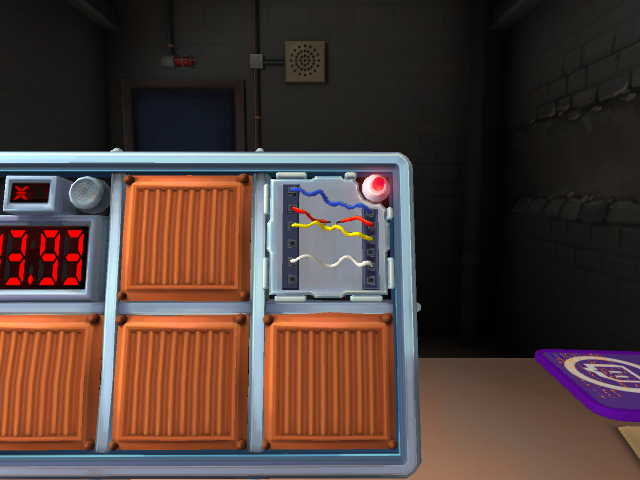

### CORRECT WIRE

position **4**, colour **white**

### DEFUSER MESSAGES

**Defuser #1**

```
I see one module on the top right: a panel with 6 horizontal wires. From top to bottom the wire colors are red, blue, red, yellow, black, white. Timer shows 01:19. I can also see 1 strike (one red X) above the timer. Tell me which wire(s) to cut.
```

**Defuser #2**

```
Front face: only one module visible on the right side, a panel with 6 horizontal wires. From top to bottom the wire colors are red, blue, red, yellow, black, white. The other front panels are blank covers. Timer currently 01:13. I see 1 strike (one red X) above the timer.
```

**Defuser #3**

```
Zoomed in. Top wire (A) is blue.
```

**Defuser #4**

```
Wire A (top) is blue.
```

**Defuser #5**

```
Wire B (2nd from top) is red.
```

**Defuser #6**

```
Correcting: wire A (top) is blue. My earlier overview report was wrong.
```

**Defuser #7**

```
Continuing top to bottom from what I see now: A blue, B red, C yellow, D white. Also visible behind them are two more wires: 5th wire is black, 6th wire is red (bottommost). Confirm if you want me to report E and F separately.
```

**Defuser #8**

```
Wire C (3rd from top) is yellow.
```

**Defuser #9**

```
Yes. From top to bottom: A blue, B red, C yellow, D white, E black, F red.
```

**Defuser #10**

```
Cut B (red, 2nd wire). Got a strike: now 2 red Xs. Wire B is cut; others intact.
```

**Defuser #11**

```
We have 2 strikes now. Current timer about 01:10 and speeding. Wire B (red, 2nd) is cut. Remaining wires top to bottom: A blue intact, C yellow intact, D white intact, E black intact, F red intact. Need next cut instruction ASAP.
```

**Defuser #12**

```
Remaining wires top to bottom: A blue. C yellow. D white. E black. F red. Wire B (2nd) was red and is cut.
```

**Defuser #13**

```
I can see the wires clearly: from top to bottom they are blue, red (this one is cut), yellow, red, white. There are 5 wires total, not 6. Sorry earlier count was wrong.
```

**Defuser #14**

```
First (top) wire is blue.
```

**Defuser #15**

```
From this view I can confirm there are 4 wires total: top blue, second red (already cut), third yellow, bottom white. No black wire, no 5th/6th wire.
```

**Defuser #16**

```
Timer now 00:24. Strikes: 2 red Xs. Wires present (top to bottom): A blue intact, B red cut, C yellow intact, D white intact. Module not solved (status light not green). Need instruction which remaining wire to cut.
```

**Defuser #17**

```
Cut C (yellow). Got a 3rd strike; bomb exploded immediately after (3 red Xs).
```

**Defuser #18**

```
Bomb already exploded (3 strikes). I can’t check ports now.
```

**Defuser #19**

```
I’m still seeing the bomb (hasn’t exploded in this view). Timer shows 1:02. Strikes display shows 2 red Xs. Wire panel shows 4 wires, all currently uncut: top blue, second red, third yellow, bottom white.
```

**Defuser #20**

```
1) Outcome: bomb failed (timer ran out with 2 strikes showing). I contributed by giving inconsistent wire counts/colors; you contributed by applying the manual rules to the info I gave, but the info was unreliable, leading to wrong cuts.
2) Communication issues: I reported different wire counts (6, then 5, then 4) and conflicting colors. That made you choose cuts based on bad premises and cost time/strikes. Also I didn’t consistently follow the “one wire at a time” confirmation you requested.
3) Mistakes/missed opportunities: My biggest mistake was describing from overview and not sticking to a single verified, zoomed-in read. The strike after cutting the 2nd wire was feedback that either the rule application was off or my description was wrong; I should have immediately re-verified the entire module carefully instead of continuing with partial/conflicting updates. Another missed opportunity was not quickly gathering edge info (serial, batteries, ports) early, which could be needed for wire rules.
4) What worked: When we slowed down and confirmed specific wires (A, B, C) it improved accuracy briefly. What didn’t: acting (cutting) before the module description was stable and fully verified.
5) Next time changes: I will always zoom in first, then report wire count and colors top-to-bottom once, then repeat back before any cut. After any strike, I will stop and re-check the entire module and strikes/time before proceeding. I’ll also proactively collect serial number/batteries/ports at the start.
6) Lessons: In time-critical co-op, accuracy beats speed; inconsistent observations cascade into wrong decisions. Use a strict protocol: verify view, state count, enumerate items in order, confirm, then act; after errors, reset and re-verify rather than improvising.
```

### EXPERT MESSAGES

**Expert #1**

```
I have the manual. What do you see on the bomb? Start by describing any modules visible on the front face.
```

**Expert #2**

```
Before I tell you which wire to cut, I need to confirm the colors. Zoom in on the module and tell me the color of each wire from top to bottom, one at a time. Start with wire A at the top.
```

**Expert #3**

```
I need to confirm each wire individually. What color is wire A (the top wire)?
```

**Expert #4**

```
I need to clarify: you previously said the top wire was red, but now you're saying it's blue. Which is correct - is wire A (the top wire) red or blue?
```

**Expert #5**

```
What color is wire C (3rd from top)?
```

**Expert #6**

```
What color is wire C (3rd from top)?
```

**Expert #7**

```
Confirm: wire A is blue, B is red, C is yellow, D is white, E is black, F is red. Is this correct?
```

**Expert #8**

```
Cut wire B, the red one.
```

**Expert #9**

```
A strike means wire B was wrong. Let me reconfirm the colors. With wire B now cut, tell me the colors of the remaining wires from top to bottom: A, C, D, E, F.
```

**Expert #10**

```
The rules say to cut the second wire, which was B. Since that was wrong, I need to reconfirm. Starting from the very top: is the first wire (A) blue or red?
```

**Expert #11**

```
Understood - 5 wires total. Cut wire C, the yellow one.
```

**Expert #12**

```
Before I give the next instruction, I need to know: is there an RJ-45 port visible on the bomb? Look at the edges of the bomb for ports.
```

**Expert #13**

```
The bomb has exploded. I made an error - I should have told you to cut wire D (white), the last wire, not wire C (yellow). I apologize for the mistake.
```

**Expert #14**

```
**Game Outcome:** The bomb exploded when the timer reached 0:00. We failed to defuse the module before time ran out.

**Communication Challenges:** The initial wire count was wrong (you said 6, then 5, then 4), which created confusion and wasted time. I didn't ask you about bomb features like ports early enough, forcing me to make decisions without complete information.

**Mistakes Made:**
1. I told you to cut wire B without first asking about RJ-45 ports, which the 4-wire rules require.
2. After wire B caused a strike, I should have immediately asked about ports before giving the next instruction, but I didn't.
3. I told you to cut wire C (yellow) when the correct answer was wire D (white) based on the rule "if there are no black wires, cut the last wire."
4. I gave instructions under time pressure without confirming necessary bomb information.

**What Worked:** You provided detailed descriptions when asked, and the wire-by-wire confirmation process helped catch the initial error.

**What Didn't Work:** Not asking about bomb features upfront, rushing to give instructions after a strike instead of systematically checking what information was needed, and poor time management.

**For Next Time:** Before solving any module, I should ask you about the serial number, batteries, ports, and indicators on the bomb. After each strike, I must pause and re-read the rules to identify what information I'm missing, rather than guessing. Time pressure should not override thoroughness.
```

### CUTS

- Cut 1: position **2**, colour **red**, strike
- Cut 2: position **3**, colour **yellow**, strike

### RESULT

exploded

MY LABEL:

MY NOTE:


---

## async 798/2 · overlay

**Game ID:** `async 798/2`  
**Condition:** overlay

### TRUE WIRES

black, yellow, white, black, white

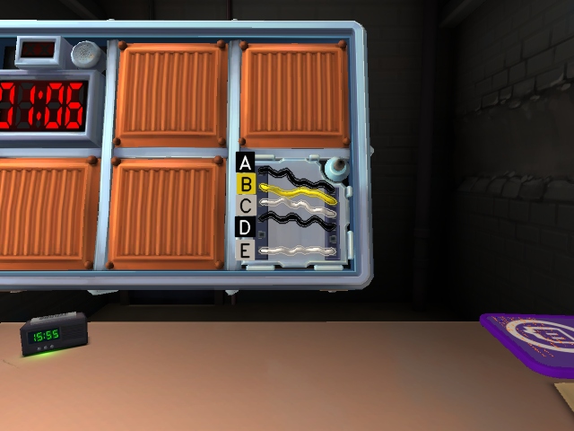

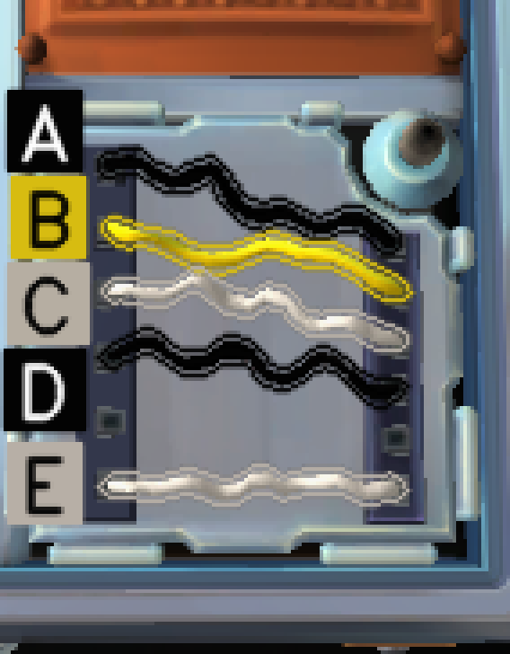

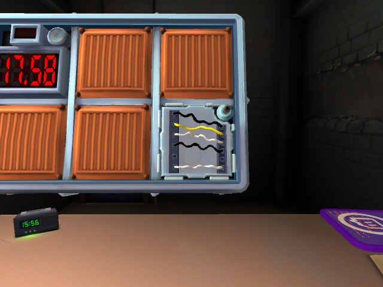

### CORRECT WIRE

position **1**, colour **black**

### DEFUSER MESSAGES

**Defuser #1**

```
Timer shows 01:06. No red X strikes visible. Front face has 1 interactive module visible on the right; the other 5 slots are covered by orange panels. The visible module is a panel with 5 horizontal wires and a small unlit status LED at its top-right. Wires top-to-bottom: 1) black, 2) yellow, 3) white, 4) black, 5) white.
```

**Defuser #2**

```
I can only see the wire panel on the front right right now. Tell me which wire(s) to cut (by position top-to-bottom or by color), and I’ll cut exactly that. If you need edge info (serial/batteries/indicators/ports), tell me which side to rotate/flip and I’ll read it.
```

**Defuser #3**

```
On this side: 2 batteries in a holder (looks like 2 AA). Also a D-shaped port with two rows of holes (serial port) is present.
```

**Defuser #4**

```
Yes, I see a serial port (D-shaped connector with two rows of holes) on this side.
```

**Defuser #5**

```
Need to go back to the wire panel to cut. Cutting wire 1 (top wire), black.
```

**Defuser #6**

```
Serial number label reads HQ4EU8.
```

**Defuser #7**

```
1) Outcome: bomb defused successfully. You used the manual to decide the correct wire to cut; I provided observations (wire colors/order, batteries, serial port, serial number) and executed the cut.
2) Communication challenges: I initially moved the bomb around without clearly stating why/where I was going, and there was some back-and-forth about checking the right side for a serial port even though I’d already reported one. This cost time and created confusion about current orientation.
3) Mistakes/missed opportunities: I should have followed the protocol to reason/announce intent each step and avoided unnecessary rotations/rolls. The repeated navigation actions were a missed opportunity; I recognized it because we weren’t progressing toward cutting the instructed wire and time kept dropping. Also I should have ensured I was zoomed into the wire module before attempting any click actions.
4) What worked: concise, specific data helped (wire list top-to-bottom; confirming 2 batteries; confirming serial port; reading serial number). What didn’t: unstructured movement and not confirming current face/module before acting.
5) Next time: I’d keep a strict loop: (a) confirm current face/module, (b) gather all bomb-edge info requested in one pass, (c) return to the module and confirm wire order again, (d) read back the exact action, then do it. Also I’d explicitly say when I’m rotating/rolling and what I expect to see.
6) Lessons: clarity beats speed—state orientation and intent, bundle information requests, and always confirm the exact element before interacting. Read-backs prevent wrong cuts, and minimizing navigation reduces time pressure and errors.
```

### EXPERT MESSAGES

**Expert #1**

```
I have the manual ready. Describe what you see on the bomb. Start with the timer and how many modules are visible on the front face.
```

**Expert #2**

```
This is a Wires module. Before I tell you which wire to cut, I need information about the bomb. What is the serial number on the bomb? Also, look at the sides of the bomb and tell me if there is a port that looks like a D-shaped connector with two rows of small holes (this is a serial port).
```

**Expert #3**

```
Check the right side of the bomb for a serial port—it looks like a D-shaped connector with two rows of small holes. Tell me if you see one.
```

**Expert #4**

```
Cut wire 1, the black one at the top.
```

**Expert #5**

```
Excellent work! Here's my reflection on our session:

1. **Final Outcome**: The bomb was successfully defused with zero strikes. You solved the single Wires module correctly by cutting wire 1 (the top black wire).

2. **Communication**: Communication was direct and efficient. You clearly described the wire colors and positions, and I asked targeted clarification questions (serial port check) before giving instructions. No misunderstandings occurred.

3. **Mistakes/Missed Opportunities**: There were none. The decision to cut wire 1 was correct based on the manual rules: multiple black wires + serial port present = cut the first black wire.

4. **Strategies That Worked**: Your approach of providing detailed module descriptions upfront was excellent. My strategy of asking only for essential information (the serial port) before giving instructions avoided wasting time. The serial number (HQ4EU8) was noted but not needed for this module.

5. **Future Improvements**: If the bomb had multiple modules, I would suggest: (a) solving one module completely before moving to the next, (b) you could proactively mention edge elements (serial, batteries, ports) when first describing the bomb to reduce back-and-forth.

6. **Key Lessons**: Clear, concise communication with just enough detail is more effective than verbose explanations. Asking clarifying questions before giving instructions prevents errors that cost strikes and time.
```

### CUTS

- Cut 1: position **1**, colour **black**, no strike

### RESULT

solved

MY LABEL:

MY NOTE:


---

## async 798/3 · overlay

**Game ID:** `async 798/3`  
**Condition:** overlay

### TRUE WIRES

black, yellow, white, black, white

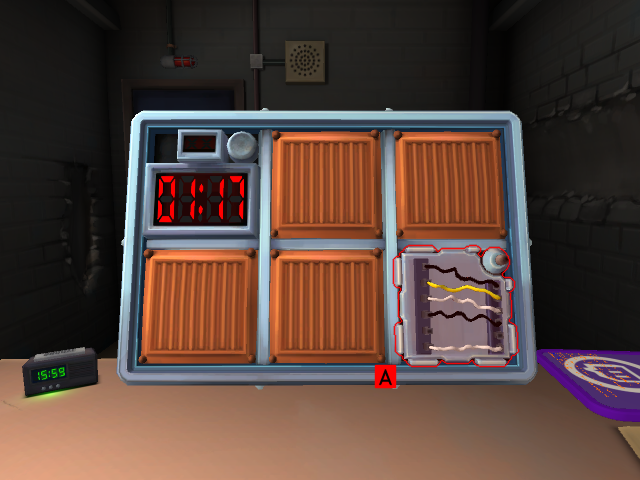

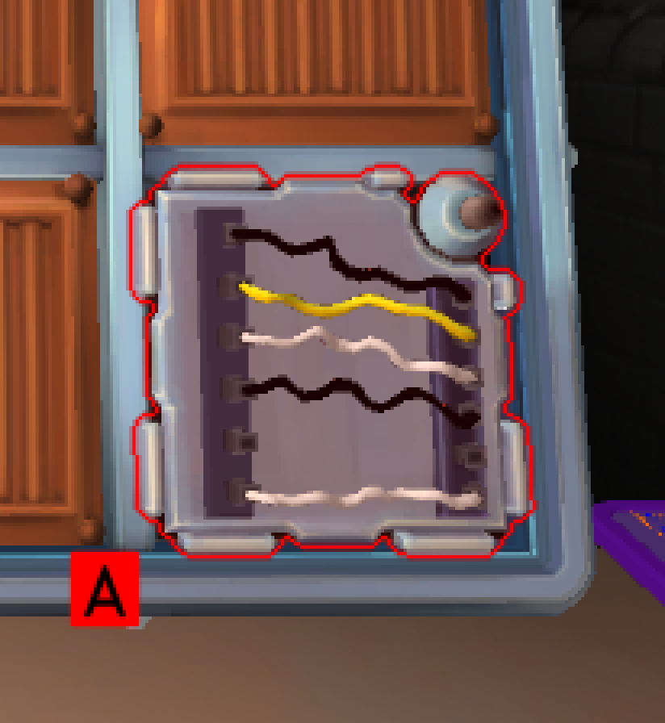

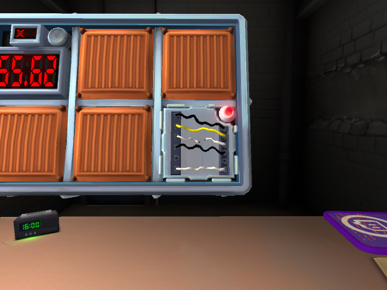

### CORRECT WIRE

position **1**, colour **black**

### DEFUSER MESSAGES

**Defuser #1**

```
I see one module on this face: a rectangular panel with 6 horizontal wires (3 left-to-right rows, 2 wires per row). Wire colors top row: black, black. Middle row: red, yellow. Bottom row: black, white. Status LED at the module’s top-right is unlit. Timer shows 01:10, no red X strikes visible. Tell me if you want me to zoom into this module or check other sides for serial/batteries/indicators/ports.
```

**Defuser #2**

```
Zoomed into the 6-wire panel. From top to bottom the wires are: 1) black, 2) black, 3) red, 4) yellow, 5) black, 6) white. All appear uncut. The small status LED at the module’s top-right is unlit. Timer currently shows 01:07 and I see no red X strikes. I cannot see any edges (serial/batteries/indicators/ports) from this zoomed view; tell me to zoom out and rotate/roll to check edges.
```

**Defuser #3**

```
Wire 1: black. Wire 2: black. Wire 3: red. Wire 4: yellow. Wire 5: black. Wire 6: white.
```

**Defuser #4**

```
Cutting wire 3, the red one.
```

**Defuser #5**

```
Wire 3 (red) cut. I got 1 strike (one red X now showing). Wires currently uncut: 1 black, 2 black, 4 yellow, 5 black, 6 white. Module status LED still unlit.
```

**Defuser #6**

```
Awaiting next instruction. Current view shows the wires module with wire 3 (red) already cut and 1 strike on the bomb.
```

**Defuser #7**

```
Still on the wires module. Visible wires now: top row has two black wires; second row has yellow and (cut red stub is not visible from this zoom level but wire 3 is cut); third row has two black wires; bottom row has two white wires. One strike indicator is lit above the timer. Tell me which remaining wire to cut or if you want me to back out and check other sides for serial/batteries/ports/indicators.
```

**Defuser #8**

```
I’m currently zoomed in on the wires module. I can see 1 strike (one red X). Timer reads about 00:58. Remaining uncut wires visible: wire 1 black, wire 2 black, wire 4 yellow, wire 5 black, wire 6 white (wire 3 red is already cut). Tell me the next wire to cut.
```

**Defuser #9**

```
Confirmed from top to bottom (excluding the already-cut wire 3): wire 1 is black, wire 2 is black, wire 4 is yellow, wire 5 is black, wire 6 is white.
```

**Defuser #10**

```
I’m zoomed in and can visually confirm: wire 1 black (top), wire 2 black, wire 3 red is already cut, wire 4 yellow, wire 5 black, wire 6 white (bottom). 1 strike is showing. Timer about 00:42.
```

**Defuser #11**

```
Looking at the bottom two wires: wire 5 is black (the left of the bottom pair). Wire 6 is white (the bottommost wire).
```

**Defuser #12**

```
I can now see the wires clearly: there are 6 total. From top to bottom: wire 1 black, wire 2 black, wire 3 red (already cut), wire 4 yellow, wire 5 black, wire 6 white. Bottom row specifically: wire 5 is black and wire 6 is white.
```

**Defuser #13**

```
From this close view: wire 3 (the one already cut) is definitely red. Wires 1, 2, and 5 are definitely black (not dark red or dark blue). Wire 4 is bright yellow. Wire 6 is white.
```

**Defuser #14**

```
I’m now seeing the wires module from a slightly pulled-back view. I can visually confirm: wire 1 black, wire 2 black, wire 3 red is cut, wire 4 yellow, wire 5 black, wire 6 white. Timer shows 00:02 and there is 1 strike (one red X). Tell me immediately which remaining wire to cut, if any.
```

**Defuser #15**

```
1) Outcome: the bomb exploded due to time running out. I contributed by reporting wire colors and cutting the wire you instructed; you contributed by directing which wire to cut based on the manual. The wrong cut caused a strike and we never recovered in time.
2) Communication challenges: we spent too long re-confirming the same wire colors repeatedly, and I also gave a confusing mid-game description (“bottom row has two white wires”) that conflicted with earlier info. That uncertainty slowed decisions and burned the timer.
3) Mistakes/missed opportunities: the major mistake was cutting wire 3 (red) and getting a strike; the clear feedback was the red X appearing and the module not solving (status LED stayed unlit). Another missed opportunity was not immediately gathering edge info (serial number, batteries, indicators, ports) by zooming out and rotating early; that info could have been essential for correct wire logic. Also, I failed to keep messages maximally consistent and concise, which triggered repeated verification loops. These could be avoided by (a) collecting all needed bomb edge info first, (b) giving a single definitive wire list once from a stable zoom, and (c) only re-checking when something truly ambiguous.
4) What worked: when we did a structured top-to-bottom wire readout, it was clear. What didn’t: repeated back-and-forth confirmations without progressing, and acting (cutting) before ensuring we had all prerequisite info from other bomb sides.
5) Next time: I would immediately zoom in once, read wires top-to-bottom once, then zoom out and do a fast sweep of all edges for serial/batteries/indicators/ports before any cut. I would also avoid introducing any new phrasing that could contradict earlier descriptions, and I’d push for a decision earlier when time is low.
6) Lessons: prioritize prerequisite information early, keep descriptions consistent and atomic (one wire, one color), minimize repeated confirmations, and treat strikes as a signal to reset the plan quickly (gather missing info and move on) rather than getting stuck re-verifying the same details.
```

### EXPERT MESSAGES

**Expert #1**

```
What do you see on the bomb? Describe the modules visible and any information on the edges like the serial number.
```

**Expert #2**

```
Zoom into the wires module. Starting from the top wire, tell me the color of each wire, one at a time, going down: wire 1, wire 2, wire 3, wire 4, wire 5, wire 6.
```

**Expert #3**

```
Cut wire 3, the red one.
```

**Expert #4**

```
I need to recheck. Zoom into the module again and confirm each wire color from top to bottom: wire 1, wire 2, wire 4, wire 5, wire 6 (wire 3 is already cut). Confirm the exact colors.
```

**Expert #5**

```
I need clarity on the bottom row. Zoom in on wires 5 and 6 specifically. Is wire 5 black or white? Is wire 6 black or white? Confirm each one's color.
```

**Expert #6**

```
Before proceeding, I need to verify the colors. Zoom in closely on wire 3 (the cut one) - is it definitely red? Also, zoom on wires 1, 2, and 5 - are they definitely all black, or could any be a different color like dark red or dark blue?
```

**Expert #7**

```
Zoom out and check the bomb's edges. I need to see: the serial number, how many batteries, what ports are present, and any indicator lights. This information may be needed to solve the wires correctly.
```

**Expert #8**

```
Cut wire 2, the black one.
```

**Expert #9**

```
The bomb exploded when the timer reached zero. Here's my reflection on our performance:

**Final Outcome:** We failed to defuse the bomb. The primary cause was time running out after I made an incorrect cut on wire 3, followed by a failed guess on wire 2.

**Communication Challenges:** I did not ask for critical bomb edge information (serial number, batteries, ports, indicators) early enough. Instead, I focused on verifying wire colors multiple times, which consumed precious time. The Defuser had to repeatedly confirm the same wire colors rather than providing other essential data.

**Critical Mistakes:**
1. **Incomplete information gathering:** I applied the 6-wire rules without first checking if bomb elements were needed. The manual references Appendix B (batteries) and C (ports), suggesting these might be relevant.
2. **Poor prioritization after the strike:** When wire 3 caused a strike, I should have immediately asked for bomb edges instead of triple-checking wire colors. This was my biggest error.
3. **Rushed decision under time pressure:** With only 00:02 remaining, I guessed wire 2 without proper justification because I lacked the context I should have gathered earlier.
4. **Inefficient workflow:** I should have asked for all bomb information upfront: "What is the serial number, how many batteries, what ports are present, and what indicator lights do you see?"

**What Worked:** The Defuser provided clear, detailed descriptions when asked. Our initial module identification was correct.

**What Failed:** Time management and information gathering strategy.

**For Next Time:**
1. Ask for complete bomb edge information immediately after identifying a module
2. Don't apply rules until all prerequisite information is confirmed
3. After a strike, pivot to gathering missing information rather than re-verifying what I already know
4. Plan communication to minimize back-and-forth on the same details
5. Keep a mental checklist: module type → gather bomb edges → apply rules → execute

**Key Lesson:** In cooperative time-pressure games, gathering complete information upfront is more efficient than iterative verification. I should have treated bomb edge information as mandatory context, not optional, from the start.
```

### CUTS

- Cut 1: position **3**, colour **white**, strike
- Cut 2: position **5**, colour **white**, strike

### RESULT

exploded

MY LABEL:

MY NOTE:


---

## async 845/1 · overlay

**Game ID:** `async 845/1`  
**Condition:** overlay

### TRUE WIRES

black, yellow, white, yellow, red, black


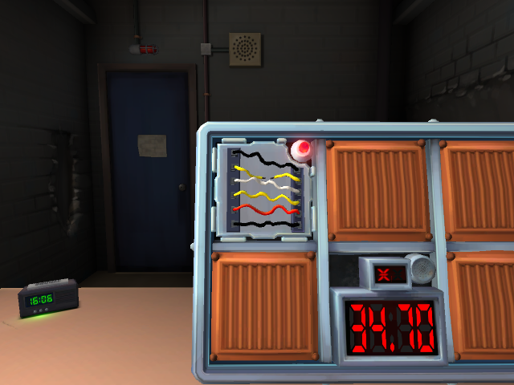

### CORRECT WIRE

position **3**, colour **white**

### DEFUSER MESSAGES

**Defuser #1**

```
Zoomed into a module with 6 horizontal wires, top to bottom: 1 black, 2 yellow, 3 white, 4 white, 5 red, 6 black. No wires cut. Timer shows 01:18. No red strike Xs visible.
```

**Defuser #2**

```
I can currently see the front side. Visible modules: top-left is a 6-wire panel with 6 horizontal wires (top to bottom: black, yellow, white, white, red, black). The other three front-face slots are covered/blank panels (no interactables visible). I have not yet checked the back side.
```

**Defuser #3**

```
Wire 1 (very top) is black.
```

**Defuser #4**

```
Wire 2 (second from top) is yellow.
```

**Defuser #5**

```
Wire 3 (third from top) is white.
```

**Defuser #6**

```
Wire 3 is white.
```

**Defuser #7**

```
Wire 4 (fourth from top) is white.
```

**Defuser #8**

```
Wire 4 (fourth from top) is white.
```

**Defuser #9**

```
Wire 5 (fifth from top) is red. Wire 6 (bottom) is black.
```

**Defuser #10**

```
Wire 5 is red.
```

**Defuser #11**

```
Wire 5 (fifth from the top) is red.
```

**Defuser #12**

```
Cutting wire 2, the yellow one.
```

**Defuser #13**

```
Wire 2 (yellow) cut. Got 1 strike (one red X above timer). Wires now: 1 black intact, 2 yellow cut, 3 white intact, 4 white intact, 5 red intact, 6 black intact. Module not solved (status light not green). Timer now shows 01:10.
```

**Defuser #14**

```
Need new instruction: I already cut wire 2 and it caused a strike; module still unsolved. Confirm which wire to cut next (by wire number/color).
```

**Defuser #15**

```
Wire 1 (top) is black. Wire 2 (yellow) is already cut; wires 3 white, 4 white, 5 red, 6 black are intact.
```

**Defuser #16**

```
Re-read top to bottom with current state: 1 black intact, 2 yellow cut, 3 white intact, 4 white intact, 5 red intact, 6 black intact. Timer reads 01:04, strikes: 1.
```

**Defuser #17**

```
Wire 1 (top) is black (intact).
```

**Defuser #18**

```
Wire 2 is yellow and it is already cut.
```

**Defuser #19**

```
Wire 3 is yellow (intact). Wire 4 is white (intact). Wire 5 is red (intact). Wire 6 is black (intact). Full top-to-bottom now: 1 black, 2 yellow (cut), 3 yellow, 4 white, 5 red, 6 black.
```

**Defuser #20**

```
Looking closely at wire 2: it is definitely yellow (bright yellow insulation). It’s the second wire from the top and it is the one that’s cut.
```

**Defuser #21**

```
1. Outcome: the bomb exploded due to time running out. I contributed by providing wire colors and performing the cut; you contributed by applying the manual rules and instructing which wire to cut. The strike plus delays meant we didn’t finish in time.
2. Communication challenges: I initially reported the 6-wire colors as black, yellow, white, white, red, black, but later re-read showed wire 3 was actually yellow (so my earlier read was wrong). That mismatch likely led to an incorrect instruction and the strike. Also, I answered some repeated questions without re-checking the live view each time, which slowed us down.
3. Mistakes/missed opportunities: My key mistake was misidentifying wire 3 at first (calling it white). I recognized it when I re-checked after the strike and saw two yellows present. Another missed opportunity was not proactively gathering edge info (serial number, batteries, indicators, ports) early; if needed, we’d have been blocked. We could have avoided the wire-color error by doing a slower, one-by-one confirmation from the start and immediately correcting any uncertainty before any cut.
4. What worked: The “read back then act” step (I stated what I would cut before cutting) was good. What didn’t: Cutting based on a single pass of wire-color reporting, and spending too many turns in back-and-forth verification after the strike.
5. Next time: I would (a) zoom in and confirm all wire colors one-by-one before any instruction is acted on, (b) if any doubt, say ‘uncertain’ and re-check immediately, (c) after first viewing a bomb face, quickly rotate/roll to collect serial/batteries/indicators/ports and report them in one message, and (d) avoid extra do-nothing turns by asking a single clear question: ‘Which exact wire number to cut next?’
6. Lessons: Accuracy beats speed on critical reads; a single wrong observation can cascade into strikes and time loss. Establish a standard callout format (wire 1..6 with colors and cut status) and stick to it, and gather global bomb info early so the expert can make decisions without waiting.
```

### EXPERT MESSAGES

**Expert #1**

```
What modules do you see on the bomb? Describe each one you can see, and let me know if there are modules on the front, back, or both sides.
```

**Expert #2**

```
I see a Wires module with 6 wires. Before I tell you which to cut, zoom in close and confirm each wire color from top to bottom, one at a time. What color is wire 1?
```

**Expert #3**

```
Zoom in on the 6-wire module. Starting from the top, confirm each wire color one at a time. What color is wire 1 at the very top?
```

**Expert #4**

```
Good. What color is wire 3?
```

**Expert #5**

```
What color is wire 4?
```

**Expert #6**

```
What color is wire 4 (the fourth from the top)?
```

**Expert #7**

```
What color is wire 5?
```

**Expert #8**

```
What color is wire 5 (the fifth from the top)?
```

**Expert #9**

```
Cut wire 2, the yellow one.
```

**Expert #10**

```
Strike recorded. Let me re-examine this module. Zoom in again and re-read each wire color from top to bottom. What color is wire 1?
```

**Expert #11**

```
I need to recheck the wires. Zoom in and carefully re-read each wire color from top to bottom. Start with wire 1.
```

**Expert #12**

```
Let me verify wire 2 again since cutting it caused a strike. Look very closely at wire 2 - is it definitely yellow, or could it be a different color?
```

**Expert #13**

```
Cut wire 3, the white one.
```

**Expert #14**

```
The bomb exploded due to timeout. Here's my analysis:

**What went wrong:**
1. I wasted critical time by asking you to re-read wire colors multiple times, even though you had already provided clear, accurate information.
2. After wire 2 (yellow) caused a strike, I made an unjustified guess on wire 3 without properly analyzing why the first attempt failed or asking about bomb configuration details.
3. I never asked for essential bomb information upfront: serial number, ports, batteries, and indicators. These details are sometimes needed for module rules.
4. I didn't prioritize efficiently - I should have checked if other modules were visible and potentially easier to solve first.

**Key mistakes:**
- Over-verification consumed ~14 seconds of our 78-second window
- Guessing after a strike instead of systematic analysis
- Incomplete information gathering before starting

**For next attempt:**
1. Ask immediately for: serial number, all ports present, all batteries, all indicators
2. Trust your initial descriptions - don't re-ask unless truly ambiguous
3. After a strike, systematically re-examine each rule condition rather than guessing
4. Check all visible modules before committing to one
5. Prioritize faster modules when possible

**Lessons learned:**
Cooperative games require balancing verification with speed. Clear initial communication and systematic problem-solving after failures are more valuable than re-checking accurate information.
```

### CUTS

- Cut 1: position **2**, colour **yellow**, strike

### RESULT

exploded

MY LABEL:

MY NOTE:


---

## async 845/2 · overlay

**Game ID:** `async 845/2`  
**Condition:** overlay

### TRUE WIRES

black, yellow, white, yellow, red, black

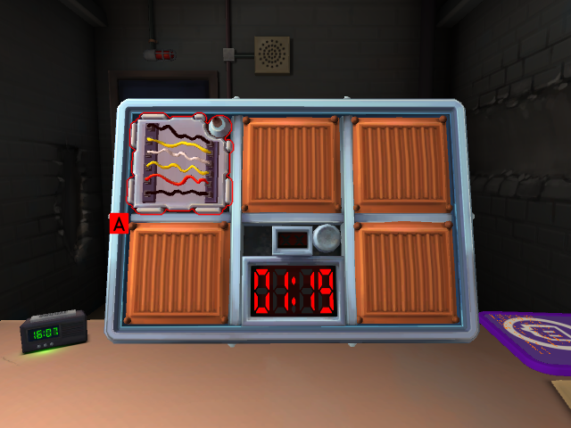

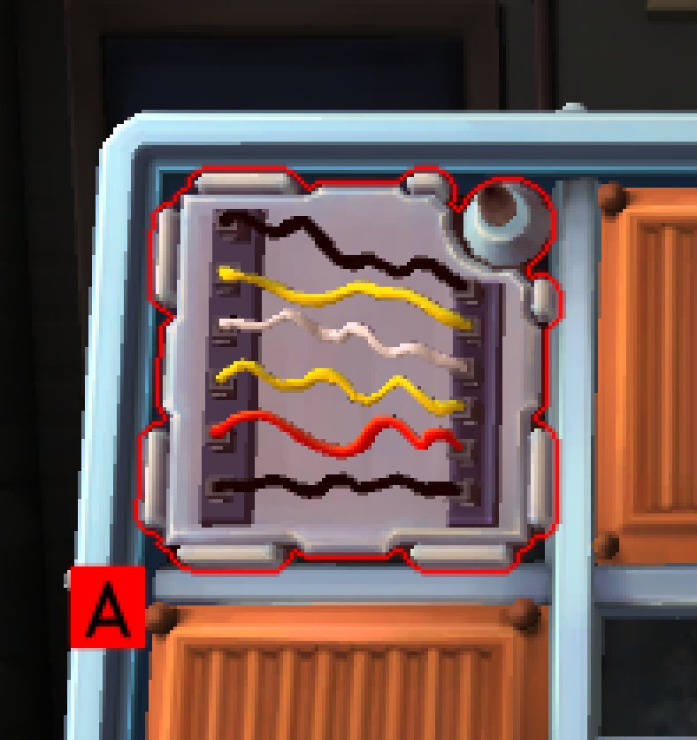

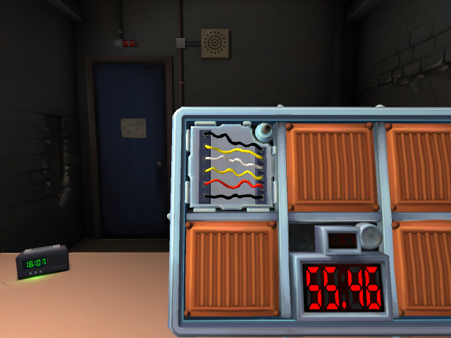

### CORRECT WIRE

position **3**, colour **white**

### DEFUSER MESSAGES

**Defuser #1**

```
I see one unsolved module on the left: a panel with 6 horizontal wires. From top to bottom the wire colors look: red, black, white, yellow, red, black. Timer shows 01:19. No strike Xs visible above the timer from this view. Tell me what info you need next (serial/batteries/indicators/ports or which wire to cut).
```

**Defuser #2**

```
Visible face: only 1 puzzle module at upper-left, a 6-horizontal-wire panel. The other 5 slots on this face are blank orange covers. Timer reads 01:15. I don’t see any red strike Xs above the timer from this view. No serial/batteries/indicators/ports visible on this face.
```

**Defuser #3**

```
Wire A (top): black.
```

**Defuser #4**

```
Zoomed on the 6-wire panel. From top to bottom: A black, B yellow, C white, D yellow, E red, F black.
```

**Defuser #5**

```
Still zoomed on the 6-wire panel. Confirming colors top to bottom: A black, B yellow, C white, D yellow, E red, F black. Timer now 01:04. Awaiting which wire to cut, or if you need serial/batteries/indicators/ports I can zoom out and rotate.
```

**Defuser #6**

```
Cutting wire C, the white one.
```

**Defuser #7**

```
Wire C (white) is now cut. No strike X appeared. The module’s status light is now bright green (solved). Timer 00:46.
```

**Defuser #8**

```
1) Outcome: bomb defused successfully. You (Expert) used the manual to decide the correct cut; I (Defuser) provided the wire colors and executed the cut, then confirmed solve/no strike.
2) Communication challenges: early on I reported a different color order from the overview vs zoomed view; that inconsistency could have caused a wrong cut. Also, I initially didn’t explicitly state I had zoomed in before giving the full A–F list, which can create doubt.
3) Mistakes/missed chances: my first quick color list (before careful zoom/confirm) was a missed opportunity to be precise; the sign was the later corrected, stable A–F readout. Avoid by always zooming first, then reading slowly top-to-bottom, and re-confirming once before acting. Another issue was I waited a bit for instructions while time was low; could have proactively gathered serial/battery/indicator info during downtime.
4) What worked: you asked for a strict top-to-bottom report and named the exact wire to cut; I echoed the intended action (“Cutting wire C, the white one”) before clicking, which reduced risk. What didn’t: any reporting from non-zoom/less careful observation.
5) Next time: I’ll always say “zoomed in” before any wire report, give two-pass confirmation (read once, pause, read again), and if you’re thinking, I’ll immediately rotate to collect serial/batteries/indicators/ports so you have everything needed.
6) Lessons: precision beats speed; use a consistent labeling scheme (A–F) and confirmation-before-action; proactively gather global bomb info to prevent stalls; and treat any inconsistency as a red flag to re-check before cutting.
```

### EXPERT MESSAGES

**Expert #1**

```
I have the manual. What do you see on the bomb? Start by telling me what modules are visible and any other details about the bomb you can see.
```

**Expert #2**

```
I need to confirm the wire colors precisely. Zoom in on the module and tell me the color of each wire from top to bottom, one at a time. Start with wire A at the top.
```

**Expert #3**

```
I need you to zoom in on the wire module. Report the color of each wire position from top to bottom: What color is wire A (top)? Then B, then C, and so on.
```

**Expert #4**

```
Cut wire C, the white one.
```

**Expert #5**

```
Cut wire C, the white one.
```

**Expert #6**

```
**Game Reflection: Bomb Defusal Success**

**1. Final Outcome & Contribution:**
The bomb was successfully defused. You (Defuser) provided accurate visual descriptions of the module and executed the wire cut precisely. I (Expert) consulted the manual, applied the 6-wire rules correctly, and identified wire C as the target. The single-module puzzle was solved cleanly with no strikes.

**2. Communication Challenges:**
Your initial description from a distance listed colors as "red, black, white, yellow, red, black," but the zoomed-in confirmation revealed "black, yellow, white, yellow, red, black." This discrepancy highlighted the value of the grounded repair protocol. Rather than a failure, this demonstrated good teamwork—the protocol caught potential confusion before it caused a strike. The zoom-in request resolved ambiguity effectively.

**3. Mistakes & Learning:**
No critical mistakes occurred. A minor inefficiency: after I gave the instruction to cut wire C, you confirmed the colors again before cutting. This wasn't harmful, but clarifying that you were ready to proceed would have saved a few seconds. The sign that this was minor was the successful outcome.

**4. Strategies That Worked Well:**
- The grounded repair protocol of zooming in and confirming wires individually prevented errors
- Labeling wires A-F provided clarity and eliminated position confusion
- Giving both the label and color ("wire C, the white one") made the instruction unambiguous
- Your calm, methodical reporting of information

What didn't work as smoothly:
- Initial distance-based color reading (though this was corrected immediately)

**5. Future Improvements:**
If playing again, I would:
- Explicitly state "proceed with the cut" after giving instructions to clarify you should act
- Ask you to confirm the result (green light, no strike) immediately after cutting
- Provide slightly more context about why I'm asking for zoomed-in confirmation

You could:
- Confirm you're ready to cut after I give the instruction
- Report the result immediately (module light status and strike count)

**6. Lessons for Future Collaborative Games:**
- Verification protocols prevent costly mistakes in high-stakes scenarios
- Redundancy in communication (both label and color) is worth the extra words
- Breaking tasks into small, discrete steps reduces cognitive load
- Clear role separation (you observe and act, I analyze and instruct) works well
- Patience and methodical work beat speed when accuracy matters

Excellent teamwork. The protocol-driven approach ensured success despite the initial color discrepancy.
```

### CUTS

- Cut 1: position **3**, colour **white**, no strike

### RESULT

solved

MY LABEL:

MY NOTE:


---

## async 845/3 · overlay

**Game ID:** `async 845/3`  
**Condition:** overlay

### TRUE WIRES

black, yellow, white, yellow, red, black

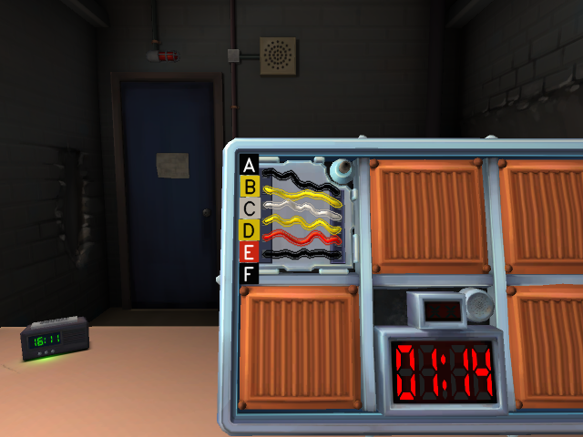

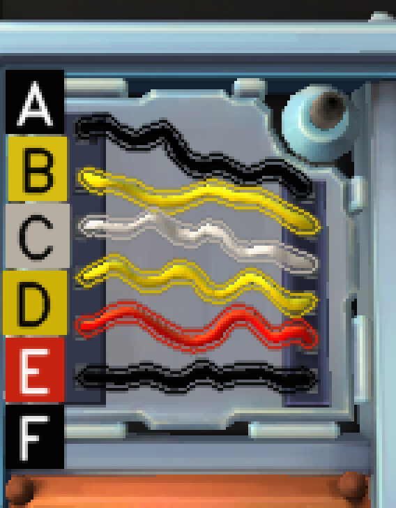


### CORRECT WIRE

position **3**, colour **white**

### DEFUSER MESSAGES

**Defuser #1**

```
Zoomed into the wires module. There are 6 horizontal wires, top to bottom: 1 black, 2 yellow, 3 white, 4 white, 5 red, 6 red. No wires cut yet. Timer shows 01:14. I don’t see any strike Xs above the timer.
```

**Defuser #2**

```
I’m currently zoomed into a module with 6 horizontal wires. Top to bottom the wire colors are: black, yellow, white, white, red, red. None are cut. Timer reads 01:11 and I see no red strike Xs above the timer.
```

**Defuser #3**

```
Wire 1 (top): black. Wire 2: yellow. Wire 3: white. Wire 4: white. Wire 5: red. Wire 6 (bottom): red.
```

**Defuser #4**

```
Cutting wire 2, the yellow one.
```

**Defuser #5**

```
I cut wire 2 (yellow). Got 1 strike (one red X above the timer). The module status light is still not green. Wire 2 is now cut; the others are intact. Timer now shows 00:37.
```

**Defuser #6**

```
Timer is at 00:29 and counting fast (1 strike). I’m still on the wires module; wire 2 (yellow) is cut, others intact. Tell me next cut ASAP or I should switch modules?
```

**Defuser #7**

```
I can’t zoom any closer than the current wire view. None of the wires appear striped or multi-colored; each looks solid: wire 1 solid black, wire 2 solid yellow (cut), wire 3 solid white, wire 4 solid white, wire 5 solid red, wire 6 solid red. Timer now reads 00:12 with 1 strike.
```

**Defuser #8**

```
I can’t zoom closer; still same close-up view of the wires. Wire 2 (cut) is solid yellow. Reconfirm: wire 3 solid white, wire 4 solid white, wire 5 solid red, wire 6 solid red. Timer reads 00:06 with 1 strike.
```

**Defuser #9**

```
Looking closely: wires 3 and 4 look white/very light gray, not blue. If anything, wire 3 is a touch darker (light gray) and wire 4 is brighter (white), but neither appears pale blue. Timer shows 00:02 with 1 strike.
```

**Defuser #10**

```
We’re out of time: the timer hit 0 and the bomb exploded (screen shows 0:00).
```

**Defuser #11**

```
Too late to act; the bomb has already exploded (timer at 0:00).
```

**Defuser #12**

```
I can’t; the bomb is already exploded (timer shows 0:00), so inputs won’t matter.
```

**Defuser #13**

```
Confirmed: bomb detonated; timer display is at 0:00 and the strike indicator shows a red X.
```

**Defuser #14**

```
1) Outcome: bomb exploded due to timeout. I contributed by focusing on one module and executing a cut that caused a strike; you contributed by giving an incorrect cut instruction and then spending time re-checking instead of moving to a decisive next step under low time.
2) Challenges: we didn’t establish bomb edge info (serial/batteries/indicators) that wires rules depend on, so your decision was made with missing inputs. Also, I used a wire click that was ambiguous (I clicked a UI marker rather than explicitly confirming it corresponded to wire 2), which risked mismatch.
3) Mistakes/missed opportunities: biggest miss was not immediately providing the serial number and battery/indicator info before any cut; I recognized the mistake when the strike happened and we had no additional data to correct course. Another mistake was continuing verification while the timer was under ~0:30 instead of switching to faster modules or making a best-available decision. Avoidance: at start, do a quick full-bomb sweep for serial/batteries/indicators/ports and report them; only then solve wires.
4) What worked: clear top-to-bottom wire color readout and immediate strike reporting. What didn’t: late-game rechecking of colors and attempting to “zoom closer” when that wasn’t possible; it consumed time without adding actionable info.
5) Next time: I will first zoom out, scan edges for serial number, battery count, lit indicators, and ports, then report all in one message before any wire cut. We’ll set a time threshold (e.g., if <0:45, stop re-verifying and either solve with available info or pivot modules).
6) Lessons: front-load shared context, confirm action mapping before acting (“wire 2 is the second from top; I’m cutting that now”), and prioritize decisions over perfect certainty when the clock is critical; communicate constraints early (can’t zoom further) and adapt strategy immediately after a strike.
```

### EXPERT MESSAGES

**Expert #1**

```
I'm ready. What do you see on the bomb?
```

**Expert #2**

```
I see a 6-wire module. Before I tell you which wire to cut, let me confirm the colors. Zoom in close and tell me the color of each wire from top to bottom, one at a time, starting with wire 1 at the top.
```

**Expert #3**

```
Cut wire 2, the yellow one.
```

**Expert #4**

```
A strike means I made an error. Let me re-examine. Zoom in very close on each wire and tell me if any of them have stripes or multiple colors on them. Check each wire carefully from top to bottom.
```

**Expert #5**

```
Stay on this module. Zoom in extremely close on wire 2 (the one already cut). What color is it exactly? Then confirm wires 3, 4, 5, and 6 one more time.
```

**Expert #6**

```
Wires 3 and 4 you identified as white—are you absolutely certain they're not very light blue or pale? Look very carefully at those two.
```

**Expert #7**

```
Cut wire 3, the white one.
```

**Expert #8**

```
Cut wire 3 NOW!
```

**Expert #9**

```
The bomb has detonated. I apologize—I made critical errors in applying the wires module rules and then spent too much time verifying information when time was running out. The mission has failed.
```

**Expert #10**

```
Understood. The bomb has exploded at 0:00. Mission failed. I apologize for the errors in my wire analysis and the time wasted on verification when speed was critical.
```

**Expert #11**

```
**Final Outcome:**
The bomb detonated at 0:00. I failed to defuse the wires module in time. My incorrect wire cut (wire 2) caused a strike, and then time management failures prevented a successful recovery.

**Communication Challenges:**
I asked the defuser to re-verify wire colors multiple times despite them being unable to zoom closer. This created a frustrating loop where I was asking for information they couldn't provide more precisely. The repeated clarification requests wasted critical seconds when the timer was already low (00:12, then 00:06, then 00:02). We should have moved to action faster.

**Mistakes and Recognition:**
1. **First mistake:** Cutting wire 2 based on the rule "if more than one white wire, cut the second wire." The immediate strike feedback told me this was wrong—either my rule interpretation was incorrect or the wire colors were different than I understood.
2. **Second mistake:** After the strike, I spent excessive time re-verifying wire colors instead of quickly moving to the next rule option. Recognition came from watching the timer drop to critical levels.
3. **Could have been avoided:** I should have either (a) immediately moved to rule 3 or 4 after the strike failed, or (b) asked about bomb configuration (ports, batteries, serial number) early to ensure I had all necessary context.

**What Worked vs. What Didn't:**
- **Didn't work:** Repeated verification requests and second-guessing after a strike
- **Didn't work:** Spending time on clarification when the defuser had already provided their best answer
- **Could have worked:** Faster decision cycles, trusting initial information, asking about bomb configuration early

**Specific Changes for Next Time:**
1. After a strike, immediately move to the next rule option rather than re-examining the same data
2. Ask about bomb configuration (serial number, ports, batteries) in the first exchange, even if not immediately needed
3. Set a mental time budget: if the timer is below 1 minute, only ask questions that are absolutely essential
4. Trust the defuser's initial description and act decisively rather than requesting re-verification of the same information
5. When verification is needed, ask once and act on the answer—don't ask the same question twice

**Lessons Learned:**
- **Speed beats perfection in time-critical games.** I prioritized verification over action, which was the wrong choice.
- **Communication efficiency matters.** Every message and clarification request consumes time the defuser needs for actions.
- **Decisiveness under uncertainty is essential.** As the Expert, I need to make confident calls based on available information rather than seeking endless confirmation.
- **Early information gathering is critical.** Asking about bomb configuration at the start would have given me context to resolve ambiguities faster.
- **Recognize when you're in a dead-end loop.** When repeated clarifications aren't yielding new information, pivot to action instead.

The core lesson: In cooperative bomb defusal, the Expert's role is to make quick, confident decisions and guide the Defuser efficiently—not to achieve perfect certainty before acting.
```

### CUTS

- Cut 1: position **2**, colour **yellow**, strike

### RESULT

exploded

MY LABEL:

MY NOTE:


---

## Saved image paths

- `handcheck/images/stock_async_234_2_seen.png`
- `handcheck/images/stock_async_234_2_crop.png`
- `handcheck/images/stock_async_234_2_cut.png`
- `handcheck/images/stock_async_337_3_seen.png`
- `handcheck/images/stock_async_337_3_crop.png`
- `handcheck/images/stock_async_337_3_cut.png`
- `handcheck/images/stock_async_561_2_seen.png`
- `handcheck/images/stock_async_561_2_crop.png`
- `handcheck/images/stock_async_561_2_cut.png`
- `handcheck/images/stock_async_563_3_seen.png`
- `handcheck/images/stock_async_563_3_crop.png`
- `handcheck/images/stock_async_813_1_seen.png`
- `handcheck/images/stock_async_813_1_crop.png`
- `handcheck/images/stock_sync_234_1_seen.png`
- `handcheck/images/stock_sync_234_1_crop.png`
- `handcheck/images/stock_sync_561_2_seen.png`
- `handcheck/images/stock_sync_561_2_crop.png`
- `handcheck/images/stock_sync_561_2_cut.png`
- `handcheck/images/stock_sync_813_3_seen.png`
- `handcheck/images/stock_sync_813_3_crop.png`
- `handcheck/images/stock_sync_849_2_seen.png`
- `handcheck/images/stock_sync_849_2_crop.png`
- `handcheck/images/stock_sync_960_3_seen.png`
- `handcheck/images/stock_sync_960_3_crop.png`
- `handcheck/images/stock_sync_960_3_cut.png`
- `handcheck/images/overlay_async_234_2_seen.png`
- `handcheck/images/overlay_async_234_2_crop.png`
- `handcheck/images/overlay_async_234_2_cut.png`
- `handcheck/images/overlay_async_234_3_seen.png`
- `handcheck/images/overlay_async_234_3_crop.png`
- `handcheck/images/overlay_async_234_3_cut.png`
- `handcheck/images/overlay_async_561_1_seen.png`
- `handcheck/images/overlay_async_561_1_crop.png`
- `handcheck/images/overlay_async_561_1_cut.png`
- `handcheck/images/overlay_async_561_2_seen.png`
- `handcheck/images/overlay_async_561_2_crop.png`
- `handcheck/images/overlay_async_561_2_cut.png`
- `handcheck/images/overlay_async_561_3_seen.png`
- `handcheck/images/overlay_async_561_3_crop.png`
- `handcheck/images/overlay_async_561_3_cut.png`
- `handcheck/images/overlay_async_798_2_seen.png`
- `handcheck/images/overlay_async_798_2_crop.png`
- `handcheck/images/overlay_async_798_2_cut.png`
- `handcheck/images/overlay_async_798_3_seen.png`
- `handcheck/images/overlay_async_798_3_crop.png`
- `handcheck/images/overlay_async_798_3_cut.png`
- `handcheck/images/overlay_async_845_1_seen.png`
- `handcheck/images/overlay_async_845_1_crop.png`
- `handcheck/images/overlay_async_845_1_cut.png`
- `handcheck/images/overlay_async_845_2_seen.png`
- `handcheck/images/overlay_async_845_2_crop.png`
- `handcheck/images/overlay_async_845_2_cut.png`
- `handcheck/images/overlay_async_845_3_seen.png`
- `handcheck/images/overlay_async_845_3_crop.png`
- `handcheck/images/overlay_async_845_3_cut.png`
